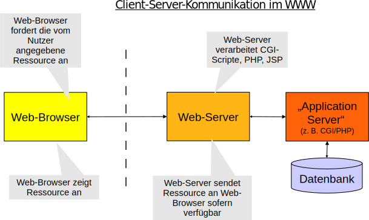

Webgrundtechniken 
=================

### Wintersemester 2011/2012
### LV 4051

### Bachelorstudiengang: Wirtschaftsinformatik / WI Plus

### Karl Glatz, BSc.
### <a href="mailto:karl.glatz@hs-weingarten.de">karl.glatz@hs-weingarten.de</a>

Drücken Sie `h` für eine Anzeige der Funktionen dieser Präsentation.

<a href="http://github.com/carlos22/Webgrundtechniken-WS11-12/raw/master/slides/WebGrundtechniken_WS1112_Slides.pdf">PDF Version</a> | <a href="http://carlos22.github.com/Webgrundtechniken-WS11-12/">HTML5 Version</a>

Teile der Präsentation basieren auf Arbeiten von Dr. Stefan Müller

---

INTRO: Lerziele und Organisation
================================

---

Lernziele
---------
- Vermittlung elementarer Techniken des WWW
- Beherrschung der grundlegenden Elemente einer statischen Webseite
- Grundsätze zur Erstellung einer modernen Web-Präsentation 
- Vertiefung der Konzepte und Grundsätze im Rahmen einer praktischen Arbeit
- Erstellung einer Webseite auf Basis von (X)HTML und CSS
- Prinzip von modernen Webanwendungen verstehen

---

Organisation
------------

- Vorlesung Montags 14:15 in H061
- Übungen, Montags 14:15 in V206/V208 (zwei Räume paralell!)
	- Übungsaufgaben sind Pflicht! (mindestens 80%)
	- Testate durch Tutoren
- Prüfungsleistung: Praktische Arbeit
	- Durchführung eines umfangreicheren <b>Web-Projekts</b> (in Zweiergruppen)
		- Erstellung einer Web-Präsentation für eine Firma, ein Projekt, Verein etc. (fiktiv oder real)
		- Beginn: 28.11.11 (spätestens)
		- Meilenstein 1: 19.12.2011 / Meilenstein 2: 9.12.2011
		- Finale Präsentation des Projekts (mündliche Prüfungsleistung):  23.1.12 / 30.1.12

---

Kalender
------------

loading...

.fx: noprint

---

Kalender Download
--------

<a href="https://www.google.com/calendar/ical/deqv6p7psqdabhbuhtgkh4ubfs%40group.calendar.google.com/public/basic.ics">Kalender als iCal-Link</a>

.qr: 400|https://www.google.com/calendar/ical/deqv6p7psqdabhbuhtgkh4ubfs%40group.calendar.google.com/public/basic.ics

---

E-Learning Plattform
--------------------

### Link: <a href="http://elearning.hs-weingarten.de" target="_blank">elearning.hs-weingarten.de</a>

<iframe src="https://www.elearning.hs-weingarten.de/" border="0" class="zoomed_frame"></iframe>

<!-- .qr: 400|http://elearning.hs-weingarten.de -->

---

INTRO: Internet und WWW
=======================

---

Entstehung des Internet
-----------------------
- Vom ARPANET zum Internet
   - 1969: ARPANET als erstes paketorientiertes Netzwerk
- 1977: Anschluss weiterer Netzwerke an das ARPANET via TCP/IP
    - TCP (Transmission Control Protocol) 
         Paketorientiertes Datenübertragungsprotokoll (auf der 4. Schicht des OSI-Referenzmodells)
    - IP (Internet Protocol) 
         Vermittlungsprotokoll (auf der 3. Schicht des OSI-Referenzmodells)     
         Vermittlung zwischen Subnetzen mit unterschiedlicher Netzwerktechnologie (auf der 1. und 2. OSI-Schicht)
- ⇒ Geburt des Internet als Netz aus verschiedenen Teilnetzen (interconnected networks)

---

Verbreitung des Internet
------------------------

---

Verbreitung des Internet #2
------------------------

---

Die Dienste des Internet
------------------------

- World Wide Web (WWW)  
    Standard zur Übermittlung von Multimedia-Dokumenten im HTML-Format.  
    Protokoll: HTTP (Hypertext Transfer Protocol)
- File Transfer (Übertragung von Dateien)  
    Standard zur Übertragung von Dateien  
-   Protokoll: FTP (File Transfer Protocol)
- E-Mail (elektronische Post)  
    Standard für den Versand von E-Mails über das Internet  
    Protokoll: SMTP (Simple Mail Transfer Protocol),  POP3 (Post Office Protocol), IMAP
- Newsgroups (auch Usenet)  
    Übertragung von Netzwerk-Nachrichten  
    Protokoll: NNTP für Net News Transfer Protocol

---

Die Dienste des Internet
------------------------

- WAP (Wireless Applications)  
    Internet-basierter Dienst zur Übertragung von WML-Dokumenten für Mobilfunkendgeräte  
    Protokoll: WAP (Wireless Application Protocol)
- TELNET / SSH  
    Terminal-Emulator zum Einloggen und Arbeiten auf entfernten Rechnern
- Voice over IP (VoIP)  
    Telefonieren über das Internet  
    Protokoll: SIP (Session Initiation Protocol)
- Chat / Instant Messaging  
    IRC (Internet Relay Chat)  
    XMPP (Jabber)
    
---

Entstehung des World Wide Web
-----------------------------

- Das WWW als weltweites Hypertextsystem
    - 1990: Entwicklung eines weltweiten Hypertextsystems auf Basis des Internets (Tim Berners-Lee)

- Die Säulen des WWW
    - <b>HTML</b>: Spezifikation einer Auszeichnungssprache für Web-Dokumente
    - <b>URIs</b> (Universal Resource Identifiers): Spezifikation für die Adressierung beliebiger Datenquellen im Internet
    - <b>HTTP-Protokoll</b>: Spezifikation für die Kommunikation zwischen Web-Clients und Web-Servern

---

Geschichte der Web-Browser
---------------------------

     
     
    

- Mosaic - Erster graphischer Browser
- Netscape 4.x
- Microsoft Internet Explorer 6.0  

⇒ Konkurrenzkampf gekennzeichnet durch die Entwicklung proprietärer Features

  

> Initiative zur (kontrollierten) Weiterentwicklung des WWW
> Definition weltweiter Standards für das WWW
> HTML, CSS, XML, …

---

Web-Browser Marktanteile
-------------------------
<iframe src="http://fc.webmasterpro.de/global/global-get-report.php?what=Browser&months=35&interval=q&filter=&ch%5BSafari%5D=on&ch%5BOpera%5D=on&ch%5BChrome%5D=on&ch%5BIE%5D=on&ch%5BFirefox%5D=on" width="800" height="450" border="0"></iframe>

---

Hypertext
---------

- Hypertext als nicht-lineares Medium
    - Pro
        - Flexibler Zugang zu Wissen (Nachschlagewerke)
        - Vernetztes Wissen kann leichter aufgenommen werden (wissenschaftlich nicht eindeutig belegt)
    - Contra
        - Steigende Komplexität
        - Gefahr des “Lost in Hyperspace” 
    - Kohäsive Geschlossenheit
        - Verständlichkeit der Informationseinheiten unabhängig vom Verweiskontext
        - Einordnung von Informationseinheiten in ihren Kontext durch Verlinkung

---

HTML und XHTML
--------------

- HTML (Hypertext Markup Language)
	- Sprache zur Auszeichnung von Texten bzw. deren Elementen (Überschriften, Absätze, Listen, Tabellen, usw.)
	- Definiert mittels SGML (Standard Generalized Markup Language)
	- Aktuell in der Version 4.01 (5.0 ist im „Working Draft“ State)
		- Rückbesinnung auf Kernaufgaben
		- Auslagerung von Layoutangaben (CSS)
		- Sprachvarianten Strict, Transitional und Frameset
- XHTML
	- HTML definiert mittels XML (XML Parser sind einfacher als SGML Parser)
	- XHTML 1.0 entspricht HTML 4.01
	- XHTML 1.1 reduziert auf  Variante Strict

---
Web-Technologien
----------------
 

---

HTML5
--------------------------

- Neue Tags
	- Audio/Video
	- &lt;article&gt;, &lt;section&gt;, &lt;header&gt;
- SVG: Vektor Grafik
- CSS3 
	- Schatten
	- Runde Ecken
	- Animation
	- Mehr-Spaltiger Text
- Javascript APIs
	-Canvas
        - WebGL
        - Offline Storage
- Test unter: 
	<a href="www.html5test.com">www.html5test.com</a>

---
HTML5 #2
--------
.fx: noheader

---
Web-Browser und Web-Server
--------------------------
  

 

---

Client Web-Technologien
-----------------------

## JavaScript & DOM

> Dynamisierung von HTML-Dokumenten im Web-Browser
> Verarbeitung von Maus- oder Tastatureingaben und Ausgaben am Bildschirm bzw. Veränderung des HTML-Dokuments
> DOM (Document Object Model): Schema für den Zugriff auf HTML-Dokumente
> Javascript Libraries (jQuery, MooTools, Dojo etc.)
> Erleichtern die Programmierung von dynamischen Seiten

## GWT
> Google Web Toolkit, RIAs mit Java programmieren, ohne Browser Plugin
> ActiveX & Java Applets (Plugins)
> Veraltete Microsoft-Technologie für dynamische „Webseiten“
> Veraltete Methode um Java Code im Browser auszuführen

## Flash & Silverlight (Plugins)
> Modernere Technologien für RIA (Rich Internet Applications)
> Flash dient oft als „lückenschließer“ für fehlende HTML/JS Features

---

Server Web-Technologien
-----------------------

## CGI & Perl
> CGI (Common Gateway Interface): Web-Server-Schnittstelle für den Programmzugriff
### Perl (Practical Extraction and Report Language)
> Script-Sprache zur Automatisierung von Datenzugriffen und -weiterverarbeitung
## PHP (PHP Hypertext Preprocessor)
> Programmiersprache zur server-seitigen Dynamisierung von HTML
> Web-Server verarbeitet PHP-Code und modifiziert HTML-Dokument
## JSP (Java Server Pages)
> Aufruf von Java-Applikationen durch den Web-Server
## ASP/.NET
> ASP (Active Server Pages): Microsoft-Gegenstück zu JSP
> .NET: Web-Applikationsframework (incl. C#)
## Python/Django, JSF uvm.

---

(Online-)Literatur
---------

## Buch
- HTML 5 Handbuch  
	<b>Kostenlos Online verfügbar</b>  
	<a href="http://webkompetenz.wikidot.com/docs:html-handbuch" target="_blank">http://webkompetenz.wikidot.com/docs:html-handbuch</a>  
	Vom Self-HTML Gründer Stefan Münz (2010)

- HTML5 Buch
	- http://html5-buch.de/
	- Viele Demos und Aufgaben

## Nachschlagewerke Online

- SELFHTML. <a href="http://www.de.selfhtml.org"  target="_blank">www.de.selfhtml.org</a>  
- Online-Internet-Kurs. <a href="http://www.www-kurs.de" target="_blank">www.www-kurs.de</a>

---
INTRO: Planung und Durchführung eines Web-Projekts
=========================================================

---

Vorgehensweise für Web-Design #1
--------------------------------

# Strategische Positionierung
- Zielsetzung & <b>Zielgruppe</b> der Webseite
	- Kommunikation und Erreichbarkeit, Information, Interaktion, Verkauf, Service- und Kundenbindungsinstrument
	- Festlegung des beabsichtigten Mehrwerts (z.B. neue Kundensegmente, bessere Kundenbindung, etc.)
- <b>Wettbewerb</b>: Vergleich mit Wettbewerbern  
- <b>Marketing</b>: Integration in Marketing-Strategie  

---

Vorgehensweise für Web-Design #2
--------------------------------

# Realisierung einer Webseite
- Festlegung der Inhalte und Struktur (Navigation)
- Festlegung der Funktionen (Value-Added Services)
- Graphisches Design
- Technologie
- Design Guidelines, z.B. www.useit.com (Jakob Nielsen)

---

Vorgehensweise für Web-Design #3
--------------------------------

# Integration
- Organisatorische Integration
	- Pflege und Aktualisierung der Inhalte
	- Wartung und Betrieb
- Technische Integration
	- Einbindung in bestehende Infrastruktur
# Monitoring
- Kundenfeedback
- Kosten-/Nutzenanalyse
- Wettbewerbsanalyse (Benchmarking)
- Technologische Entwicklung

---
Kriterienkatalog für Webseiten
------------------------------

---

Beurteilungskriterien #1
-------------------------

# Erster Eindruck
> Ist die Präsentation übersichtlich?  
> Ist das Grundthema klar erkennbar?  
> Wirkt ein einheitlicher angemessener Gesamteindruck?  
# Inhalt
> Erhält man auf der Startseite einen Überblick über den Inhalt?  
> Ist der Informationsgehalt ausreichend?  
> Ist die Zielsetzung klar ersichtlich?  
> Sind die für die Nutzung erforderlichen Funktionen vorhanden?  
> Ist der Inhalt nach Themen geordnet?  

---

Beurteilungskriterien #2
-------------------------
# Struktur
> Ist die Struktur auf den ersten Blick durchschaubar und leicht nachvollziehbar?  
> Sind die einzelnen Themenblöcke gut strukturiert?  
> Sind Navigationselemente und Links erkennbar? Ist die Verlinkung sinnvoll und umfangreich?   

# Navigation
> Ist die Navigation bzw. Hierarchie nachvollziehbar?  
> Ist der Standort innerhalb der Web-Site jederzeit erkennbar?  
> Ist die Navigation durchgehend und prägnant?  
> Ist der Schritt zur Startseite jederzeit möglich?  

---

Beurteilungskriterien #3
-------------------------

# Design
> Steht der Inhalt durch das Design weiterhin im Vordergrund?  
> Spiegelt das Design die Zielsetzung wider?  
> Spricht das Design die Zielgruppe an?  
> Ist genügend Farbkontrast vorhanden?  
> Sind die benutzten Farbtöne harmonisch?  
> Ist das Design durchgehend?  
> Ist der Text lesbar, die Schriftart und -größe angemessen?  
> Sind besuchte Links markiert?  

---

Beurteilungskriterien #4
-------------------------

# Grundsätze und Technik
> Ist die Präsentation unabhängig vom Browser (IE, Firefox, Chrome, Safari)?  
> Passt sich die Darstellung den Anforderungen des Nutzers an (Auflösung, Schriftgrößen)?  
> Sind Inhalt und Design strikt getrennt (HTML und CSS)?  
> Ist die Präsentation bezüglich Inhalt, Struktur und Design ausreichend komplex?  
> Sind die verwendeten HTML- und CSS-Elemente sinnvoll eingesetzt?  
> Ist ein alternatives Design für den Ausdruck vorhanden?  

