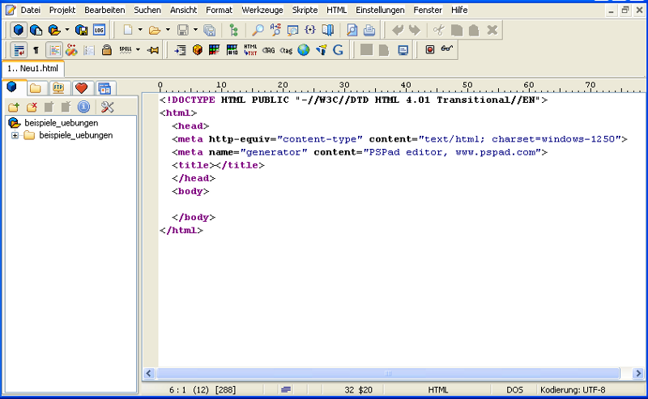
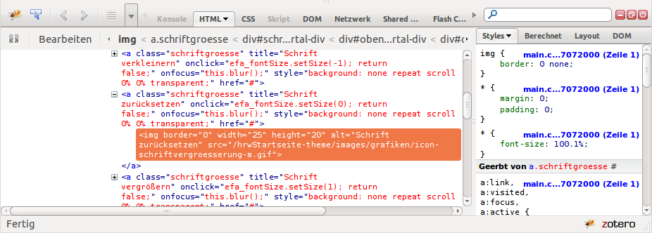

HTML Basics
===========

## Presenter Notes
Praktischer Einstieg, theorie später!

---

HTML Bascis: Inhalt / Ziel
--------------------

- Was ist HTML?
- HTML Grundgerüst
- Textformatierung
- Links
- Listen
- Weitere Textauszeichungen (physisch und logisch)
- Allgemeine HTML Elemente
- Bilder einbinden

=> Vertiefung der Kentnisse in Übung 1 (nächste Woche).

---

Das HTML Format
---------------

- HTML Dateien sind Text-Dateien
- Bearbeitbar mit einfachem Texteditor (z. B. Notepad, gedit, TextMate)
- Spezialisierte HTML Editoren
	- Windows: PSPad / Notepad++
	- Linux: gEdit / Kate / Geany
	- OSX:  TextMate
- Dateiendung *.html oder *.htm
- Programm zum Anzeigen einer HTML-Datei: Browser
	- Chrome, Firefox, Safari, Opera, IE

.notes: Es gibt sogenannte WYSIWYG Editoren, verwendet kein Profi ⇒ Wir also auch nicht!!

---
Aufgabe von HTML
-----------------
- Idealisiert:
	- Textauszeichnung
		- Bedeutung von Textelementen festlegen (Semantik)
	- NICHT Textpräsentation, Layout, Design
		- CSS
- Realität:
	- Bau von Webseiten im Zusammenspiel mit CSS und JavaScript

---
Der HTML-Editor PSPad
---------------------

---

Entwicklertools im Browser
-------------

- Firefox: Addon <a href="https://addons.mozilla.org/de/firefox/addon/firebug/" target="_blank">Firebug</a>
- Chrome:  Schraubenschlüssel => Tools => Entwicklertools | UMSCHALT+STRG+I | F12
- Safari:  ALT+CONTROL+I
- Opera:   Tools => Advanced => Opera Dragonfly

Aktuelle Versionen vom Internet Explorer bieten ebenfalls Entwicklertools.

---

HTML4-Datei Aufbau
-----------------

	!html
	<!DOCTYPE HTML PUBLIC "-//W3C//DTD HTML 4.01 Transitional//EN" 
	"http://www.w3.org/TR/html4/loose.dtd">
	<html>
	  <head>
	    <title>Titel der Seite</title>
	  </head>
	  <body>
		<h1>Überschrift der Seite</h1>
		
Ein Absatz mit Etwas Text

	  </body>
	</html> 

- Dokumenttyp-Deklaration: Deklariert die verwendete Auszeichnungssprache, d.h. das vereinbarte „Regelwerk“
- HTML 4.01 Sprachvarianten
	- Strict: Keine Verwendung unerwünschter Elemente
	- Transitional: Verwendung aller Elemente
	- Frameset: Definition von Framesets

---

HTML5-Datei Aufbau
-----------------

	!html
	<!DOCTYPE HTML>
	<html>
	  <head>
	    <title>Titel der Seite</title>
	  </head>
	  <body>
	  </body>
	</html>

.fx: html5

- HTML5 kennt keine verschiedenen Varianten mehr
	- Keine Frames mehr!
	- Kein DTD nötig, da HTML5 formell keine SMGL Sprache mehr ist.
	- Im nicht-HTML5 Browser: Standards Mode
---
HTML Tags
---------

- Tags sind immer in spitzen Klammern eingeschlosse  
	<pre>&lt;tagname&gt;</pre>
- Tags werden (fast) immer geschlossen  
	<pre>&lt;tagname&gt;&lt;/tagname&gt;</pre>
- Zwischen den Tags kann (meist) Text und/oder weitere Tags stehen  
	<pre>&lt;b&gt;Text&lt;/b&gt;</pre>
- Tags können (beliebig viele) Attriube haben  
	<pre>&lt;b class="test"&gt;Text&lt;/b&gt;</pre>

---
Text formatierung
-----------------

.fx: column2

	!html
	
Das ist etwas Text

Das ist etwas Text

P steht für Paragraph und bildet einen Absatz

	!html
	
Das ist etwas Text mit einem 
	Umbruch im Text

Das ist etwas Text mit einem Umbruch im Text

br erzeugt (weiche) Umbrüche im Text (in Word/Writer: STRG+ENTER)

<ul><li>Überschriften</li></ul>

	!html
	<h1>Überschrift 1</h1>
	<h2>Überschrift 2</h2>
	<h3>Überschrift 3</h3>
	<h4>Überschrift 4</h4>
	<h5>Überschrift 5</h5>
	<h6>Überschrift 6</h6>

<h1>Überschrift 1</h1>
<h2>Überschrift 2</h2>
<h3>Überschrift 3</h3>
<h4>Überschrift 4</h4>
<h5>Überschrift 5</h5>
<h6>Überschrift 6</h6>

- Überschriften sind nicht nur ein visuelles Mittel!
	- Semantische Auszeichnung
	- Wichtig für maschnielle Verarbeitung, z. B. Suchmaschinenen und Sehbehinderte

---
Zeilenumbruch
-------------
- Zeilenumbruch erzwingen
	- &lt;br&gt; (Standalone-Element)
- Zeilenumbruch verhindern
	- &amp;nbsp; erzeugt ein geschütztes Leerzeichen
	- An einer solchen Stelle erfolgt kein Umbruch
	- Alternative Schreibweise: &amp;#160;
- Bedingter Zeilenumbruch
	- &amp;shy; markiert eine Stelle an der getrennt werden darf Browserunterstützung mangelhaft, daher vermeiden

---
Hyperlinks
----------

	!html
	<a href="http://scooter.de" target="_blank">HYPER HYPER</a>
	<a href="[URI]" target="[ZIEL]">[SICHTBARER TEXT]</a>
	

<a class="demo" href="http://scooter.de" target="_blank">HYPER HYPER</a>

- Herzstück des WWW: Ermöglichen Kontext von Informationen
- Prizip: Weiterentwicklung von Literaturverzeichnissen aus Wissenschaftlichen Publikationen  
- Vordefinierte optionen für `target`
	- `_blank`: Anzeige des Verweisziels in neuem Fenster
	- `_self`: Anzeige des Verweisziels in aktuellem Fenster
	- `_parent`: Anzeige in Vaterfenster bei verschachteltem Frameset
	- `_top`: Anzeige in Hauptfenster bei verschachteltem Frameset

---
URI: Uniform Resource Identifier
--------------------------------
 
<blockqoute class="bigqoute">Ein Uniform Resource Identifier (URI) (engl. „einheitlicher Bezeichner für Ressourcen“) ist ein Identifikator und besteht aus einer Zeichenfolge, die zur Identifizierung einer abstrakten oder physischen Ressource dient. URIs werden zur Bezeichnung von Ressourcen (wie Webseiten, sonstigen Dateien, Aufruf von Webservices, aber auch z. B. E-Mail-Empfängern) im Internet und dort vor allem im WWW eingesetzt.</blockqoute>

### Presenter Notes
- Nicht nur Adressen von Webseiten sondern auch von Resourcen innerhalb der Webseite (Grafiken, CSS etc.)

---
Verweise innerhalb einer Datei
------------------------------
	!html
	<a href="[URI]#[Ankername]">Verweistext</a>

- Regeln für Ankernamen (bzw. IDs):  
	- sollten nur Buchstaben, Ziffern und die Sonderzeichen Unterstrich, Bindestrich, Punkt und Doppelpunkt enthalten
	- Ankernamen und ID-Attribute müssen dateiweit eindeutig sein

Beispiel: <a href="http://de.wikipedia.org/wiki/Html#Syntax">Wikipedia Artikel HTML, Abschnitt Syntax</a>

---
Verweise zu Email-Adressen
--------------------------

	!html
	<a href="mailto:[email-Adresse]">Verweistext</a>
	<a href="mailto:karl.glatz@hs-weingarten.de">Karl</a>
	<a href="mailto:karl.glatz@hs-weingarten.de?cc=karl.glatz@gmail.com">
	Karl Glatz</a>

- Optionen bei Email-Verweisen
	- cc, bcc, subject und body
- Optionen werden als Parameter des href-Attributs übergeben, eingeleitet durch ein ?
- Problem: Spam-Bots durchsuchen internet nach mailto: Adressen!
	- Lösungen: oft wird die Adresse verunstaltet oder mit JS encodiert

---
Listen: Aufzählungslisten (unordered list)
-----------------------------

	!html
	<h2>Einkaufsliste</h2>
	<ul>
		<li>Milch</li>
		<li>Eier</li>
		<ul>
			<li>3x Bio</li>
			<li>2x Freiland</li>
		</ul>
		<li>Spagetti</li>
	</ul>

<h2>Einkaufsliste</h2>
<ul>
	<li>Milch</li>
	<li>Eier</li>
	<ul>
		<li>3x Bio</li>
		<li>2x Freiland</li>
	</ul>
	<li>Spagetti</li>
</ul>

<b>ul</b>: <b>u</b>norderd <b>l</b>ist | <b>li</b>: <b>l</b>ist <b>i</b>tem

### Presenter Notes
Kind-Elemente ul: li-Elemente  
Eltern-Elemente li: ul- oder ol-Elemente  
Kind-Elemente li: Block-Elemente und Inline-Elemente  
Beliebige Verschachtelungen von Listen sind möglich  

---
Nummerierte Listen (ordered list)
----------------------------------
	!html
	<h2>Anleitung</h1>
	<ol>
		<li>Download</li>
		<li>Entpacken</li>
		<li>Starten ...</li>
	</ol>

<h2>Anleitung</h1>
<ol>
	<li>Download</li>
	<li>Entpacken</li>
	<li>Starten ...</li>
</ol>

<b>Achtung:</b> Verschachtelung nummerierter Listen bewirkt keine Nummerierungshierarchie (<a href="http://aktuell.de.selfhtml.org/artikel/css/nummerierung/">Mit CSS möglich</a>)

---
Präformatierter Text
--------------------
	!html
	<pre>präformatierter 
		<b>Text</b> mit ein paar
	Umbrüchen und
	        Einrückungen!</pre>

<pre class="demo">präformatierter 
		<b>Text</b> mit ein paar
	Umbrüchen und
	        Einrückungen!</pre>

Anzeige mit Formatierungen in dichtengleicher Schrift  
Aber: HTML-Zeichen werden interpretiert

- Verwendung
	- Anzeige von Quellcode
	- vordefinierten Tabellen, etc.

---
Zitate und Adressen
-------------------
	!html
	<blockquote>
there are only two hard problems in computing: caching, 
	concurrency and off-by-one errors
</blockquote>
<blockquote class="demo">
there are only two hard problems in computing: caching, concurrency and off-by-one errors
</blockquote>

- Zitate
	- Kind-Elemente: Block-Elemente
	- Attribut cite: URI der zitierten Quelle (ohne Visualisierung)
	- &lt;blockquote cite="http://www.hs-weingarten.de/"&gt; ...
- Adressen
	Kind-Elemente: Inline-Elemente

	!html
	<address>Hochschule Ravensburg-Weingarten 
	Doggenried Str. 
	88250 Weingarten</address>

---
Logische Textauszeichnung
---------------------------------------
.fx: column2

- Logische Auszeichnungen im Text
	- Elemente definieren logische Bedeutung unabhängig von einer konkreten Darstellung
	- Logische Auszeichnungen sind Inline-Elemente
- Elemente zur logischen Textauszeichnung
	- em – empathisch, betont
	- strong – stark betont
	- code – Quelltext
	- samp – Beispiel
	- kbd – Benutzereingaben
	- var – Variable
	- cite – Quelle oder Autor
	- dfn – Definition
	- abbr – Abkürzung
	- acronym – Akronym
	- q - Zitat
	- del - gelöschter Text   
	  ins - eingefügter Text
		- Attribut datetime: Zeitpunkt der Änderung
		- Attribut cite: URI als Grund für Änderung

---
Physische Textauszeichnung
----------------------------------------
.fx: column2

- HTML4: Elemente definieren direkt eine gewünschte Darstellung
- HTML5: Jeweils "schwache" semantische Bedeutung zugeordnet => Styling CSS
- Elemente zur physischen Textauszeichnung
	- b – fett (bold)
	- i – kursiv (italic)
	- <del>tt – dichtengleich (teletyper)</del>*
	- <del>big – größer als normal</del>*
	- <del>center - zentriert</del>*
	- <del>strike - durchgestrichen</del>*
	- small – kleiner als normal
	- sup – hochgestellt (superior)
	- sub – tiefgestellt (subordinate)
- Sonstige Elemente: hr – trennlinie

*nicht in HTML5: <a href="http://www.w3.org/TR/html5-diff/#absent-elements">W3C: HTML5 vs HTML4</a>

---
Allgemeine Elemente für Textbereiche
------------------------
- Allgemeines Block-Element
	- div
	- Kind-Elemente: Block-Elemente und Inline-Elemente
- Allgemeines Inline-Element
	- span
	- Kind-Elemente: Inline-Elemente
- Formatierung allgemeiner Elemente mit CSS
	- Allgemeine Elemente ermöglichen die logische Auszeichnung von	Abschnitten oder Blöcken
	- Formatierung mit CSS

---
Allgemeine Elemente HTML5
------------------------

.fx: html5

- HTML5 biete neue allgemeine Elemente
	- article – Artikel z. B. in einem Blog
	- section – Abschnitt eines Textes
	- nav – Navigation, Menü
	- header – Kopf einer Seite
	- footer – Fuß einer Seite
	- aside – z.B. Sidebar bei einem Blog

- Alle Elemente verhalten sich wie das div, bieten jedoch die möglichkeit das HTML-Dokument besser zu strukturieren.

---
Grafikformate: Vektor und Pixel
-------------------------------
.fx: column2

- Pixel:
	- <b>JPEG</b>: Joint Photographic Experts Group
		- Verlustbehaftetes Format
		- Einsatzzweck: Fotos von Personen, Landschaften etc.
	- <b>PNG</b>: Portable Network Graphics
		- Verlustfreies Format
		- Echte Transparenz: Alpha Kanal
		- Animierte Varianten: APNG, MNG (fehlender Browser Support)
		- Einsatz: Alle Grafiken wie Verläufe, Comics, Zeichnungen, Buttons etc.
	- <b>GIF</b>: Graphics Interchange Format
		- Verlustfreies Format
		- Limitierter Farbraum
		- Einfache Transparenz (1-Bit)
		- Einsatzzweck: Animation
		- <b>Veraltetes Format!</b>
- Vektor:
	- <b>SVG</b>: Scalable Vector Graphics
		- Einsatzzweck: Grafiken wie Karten, Logos, Wappen, Zeichnungen, usw.
	- <a href="http://diveintohtml5.org/canvas.html" target="_blank"><b>Canvas</b></a>: Generierte Vektorgrafik
		- Einsatzzweck: Interaktive Spiele, Animationen etc.
		- Grafik muss programmiert werden in JavaScript

## Presenter Notes

- SVG Tools: Inkscape, Adobe Illustrator
- Pixel Tools: Photoshop, Gimp etc.

---
Einbinden von Bildern
---------------------
	!html
	

- Referenz auf eine Graphik
	- img-Element ist Standalone-Element
- Attribut `src` bestimmt die Graphikdatei
	Beachten Sie die Möglichkeiten zur Referenzierung von Dateien in HTML
- Attribut `alt` definiert alternativen Text 
	- IE: Tooltip
		- Tooltips normalerweise via Universalattribute `title`
	- Alle: Falls Bild nicht angezeigt werden kann; Screenreader

---
(Veraltete) Attribute für Bilder
-------------------------------
- Größe der Grafik: `width`, `height`
	- Bei langsamen Verbindungen führt angabe zur schnelleren Seitendarstellung
	- Abweichende Größen zum Original sind nicht empfehlenswert:
		- Schlechte Skalierungsalgorithmen der Browser
		- Höhere Ladezeiten bei verkleinerung der Grafiken
- Ausrichtung:
	- `align`, `vspace`, `hspace`
- Für beides sollte heute CSS verwendet werden! (HTML4 Strict/HTML5)

- <a href="http://webkompetenz.wikidot.com/html-handbuch:image-maps" target="_blank">Image Maps</a>: Verweissensitive Grafiken

