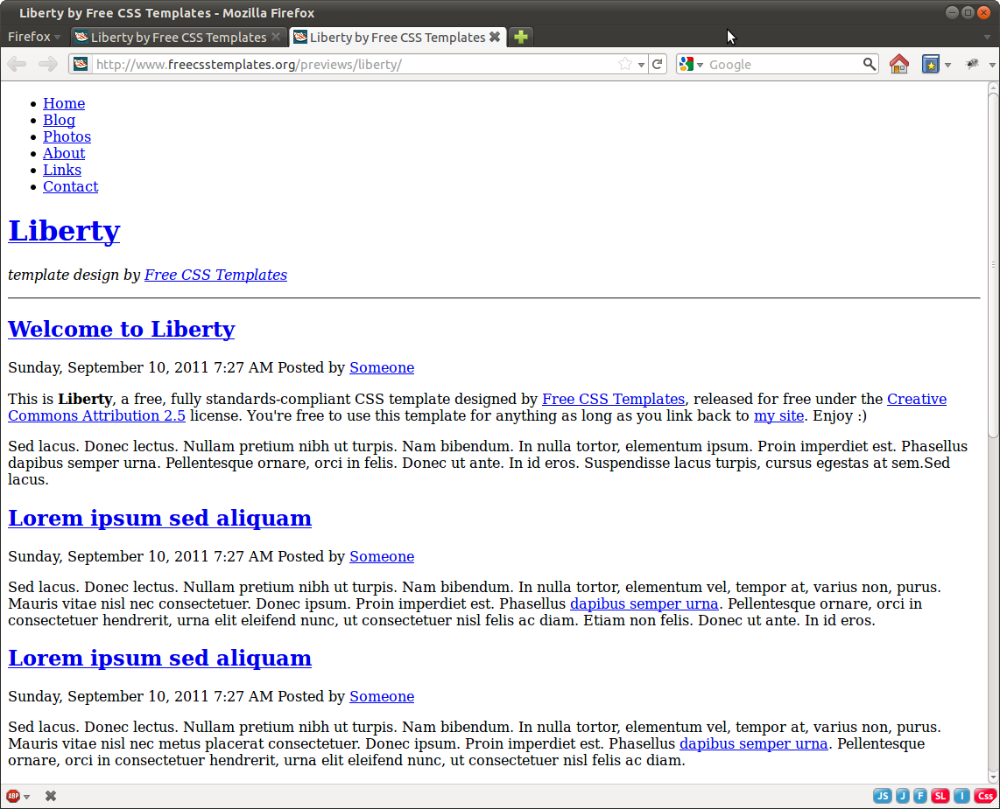
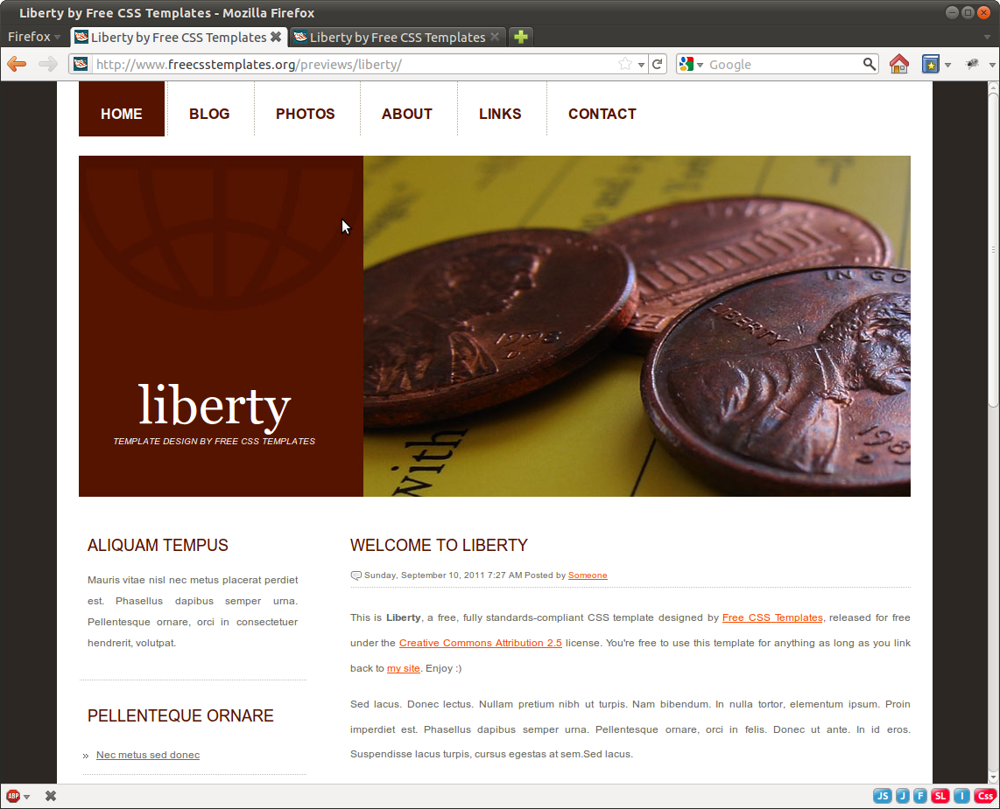
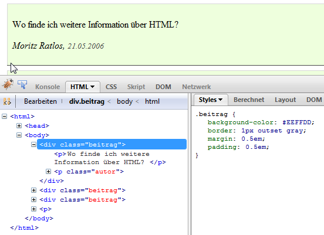
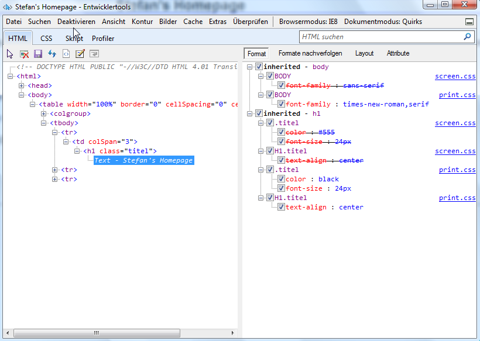
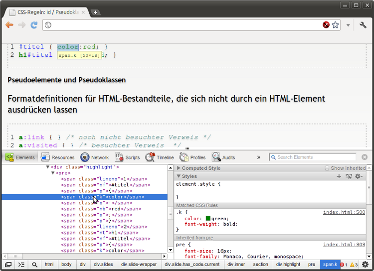

CSS Basics
==========

---

Stylesheets
-----------

###Grundidee von Stylesheets
<blockquote>

* Definition von <em>Formateigenschaften</em> für HTML-Elemente
* Strikte Trennung von Inhalt und Layout/Design
* Zentralisierung/Externalisierung von Formatdefinitionen
* Bereitstellung unterschiedlicher Layouts für ein Web-Projekt (adaptive
Webseiten)
</blockquote>

### Stylesheet-Sprachen
  <blockquote>

 * CSS (Cascading Style Sheets): Formatierung von HTML-Dokumenten (W3C-Standard)
 * XSL (Extensible Stylesheet Language): Formatierung von XML-Dokumenten (W3C-Standard)
</blockquote>

---
Was kann CSS?
-------------

---
Was kann CSS?
-------------

 // TODO: Image Zoom

---
CSS3
----
### CSS3 Beispiele

---
CSS: Gefahren/Fallstricke
-------------------------

* Mangelnde Browserunterstützung (IE < 9.0)
* Farbdarstellung oder Schriftgrößen nicht zwingend einheitlich (Rendering Bugs)
* Umfassende Formatierungsmöglichkeiten verführen oft zu übertriebenen Layouts

###Grundregeln
 * Ordentliche Farbkontraste
 * Keine kritischen Farbkombinationen (rot/grün)
 * Normale Schriftarten, Größen, Zeilenhöhen, usw.
 * Durchgängiges Layout/Design (CI/CD)

---
CSS-Definition: HTML Kopf
--------------------------
### Definition zentral für eine HTML-Datei
	
	!html
	<head>
	
	</head>

Beispiel
	
	!html
	<head>
	
	</head>

---
CSS-Definition: Datei
--------------------------

### Definition in separater CSS-Datei

	!html
	<head>
	<link rel="stylesheet" type="text/css" href="formatierung.css"></link>
	</head>

CSS-Datei

 * Textdatei mit der Endung `.css`
 * Zeichenkodierung `@charset "UTF-8";`
 * Kommentare: `/* ... */`
 * Stylesheet-Definitionen
	* `[selector] { [Eigenschaft]:[Wert]; ...}`

---
CSS-Definition: HTML-Element
--------------------------
### Definition innerhalb eines HTML-Elements

	!html
	<h1 style="color:blue;">...</h1>
 
* Universalattribut `style="[Eigenschaft]:[Wert];"'
* Kein Selektor (bezieht sich nur auf aktuelles Element)
* Verschachtelte Definitionen
	* Definitionen in externen CSS-Dateien, im HTML-Kopf sowie innerhalb eines HTML-Elements können kombiniert werden
	* Die inneren Definitionen überschreiben die äußeren   <strong>`CSS­Dateien ->  HTML­Kopf -> HTML­Element`</strong>

---
Ausgabemedien-spezifisches Design
---------------------------------

* Separate Stylesheet-Dateien für unterschiedliche Ausgabemedien
* Einbindung unterschiedlicher CSS-Dateien für unterschiedliche
* Ausgabemedien
	* Mögliche Medien: `all, aural, handheld, print, screen, ...`
	* Begrenzte Unterstützung durch Browser

 

	!html
	<link rel="stylesheet" type="text/css" href="[CSS-Datei]" media="[Medium, ...]">
	</link>

---
Ausgabemedien-spezifisches Design
---------------------------------

Spezifische Stylesheet-Definitionen für unterschiedliche Ausgabemedien

	!html
	
	
Einbindung mittels CSS-@import

	!html
	

In einer CSS-Datei müssen `@import`-Anweisungen am Anfang der Datei stehen

---
CSS-Regeln festlegen 
--------------------
* Aufbau zentraler CSS-Definitionen  <strong>`[Selector] { [CSS-Eigenschaft] : [Wert]; }`</strong> 
* <strong>Selektor</strong> wählt aus, für welche Elemente die folgenden Definitionen gelten
* CSS-Definitionen für HTML-Elemente

Definition der Formatierung von HTML-Elementtypen (h1, b, etc.)

	!css
	h1 { color:green; font-size:24px }
	h1, h2 { color:green; font-size:24px }
	* { color:green; font-size:24px }

Universalselektor: *

---
CSS-Regeln: Verschachtelte Elemente
--------------------
CSS-Definitionen für verschachtelte Elemente

Nachfahren-Selektoren

	!css
	h1 b { font-style:italic }

Mindestens eine Ebene zwischen h1 und b

	!css
	h1 * b { font-style:italic }

b direktes Kindelement von h1 Nachbar-Selektor

	!css
	h1 > b { font-style:italic }

p unmittelbarer Nachfolger von h1

	!css
	h1 + p { font-style:italic }

---
CSS-Regeln: Attribute und Klassen
-----------------------------------------
### Formatdefinitionen für Elemente mit bestimmten Attributen oder Attributzuweisungen

	!css
	h1[align] { font-style:italic }
	h1[align=center] { font-style:italic }
	*[align=center] { font-style:italic }

### CSS-Definitionen für Klassen  
Formatdefinitionen für Elemente einer bestimmten Klasse

	!css
	h2.neu { color:red }
	*.neu { color:red } 
	/* oder */
	.neu { }

---
CSS-Regeln: class + span/div
-----------------
* CSS-Definitionen für Klassen mit div und span
* Die Elemente div und span ermöglichen die Zuweisung (semantischer) Klassennamen an beliebige Bereiche oder Gruppen von Elementen
* Diese Bereiche können dann mit CSS formatiert werden

CSS Code

	!css
	.neu { color:red; }
	.anmerkung { font-style:italic; font-size:10px }
	.quelle { font-style:italic; font-size:8px }

HTML Code

	!html
	...

---
CSS-Regeln: id / Pseudoklassen
-----------------
###CSS-Definitionen für einzelne Elemente
Formatdefinitionen für Elemente mit einer bestimmten ID

	!css
	#titel { color:red; }
	h1#titel { color:red; }

### Pseudoelemente und Pseudoklassen
Formatdefinitionen für HTML-Bestandteile, die sich nicht durch ein HTML-Element ausdrücken lassen

	!css
	a:link { } /* noch nicht besuchter Verweis */
	a:visited { } /* besuchter Verweis  */
	a:hover { } /* Verweis auf den die Maus zeigt  */

---
CSS-Regeln: Pseudoklassen
--------------------------
## Before / After

CSS

	!css
	h4:before { content: ">> " }
	h4:after { content: url('http://up.frubar.net/1170/css_icon.png') }

HTML  

	!html
	<h4>Testueberschrift</h4>

<h4 class="testbefore">Testueberschrift</h4>

Beispiel: <a href="http://www.mediaevent.de/css/generated.html">Linkadressen werden beim Drucken mit ausgedruckt</a>

---
Verhalten von HTML-Elementen: Block
------------------------

	!html
	

		<h1>Überschrift</h1>
		
Etwas Text

		Nur <b>Text</b> ohne p...
	

	<h1>Überschrift</h1>
	
Etwas Text

	Nur <b>Text</b> ohne p...

- Block-Elemente
	- Erzeugen einen eigenen Absatz im Textfluss
	- Können i.d.R. enthalten
		- Text (#PCDATA)
		- Block-Elemente <strong>und</strong> Inline-Elemente
		- Beispiele: &lt;h1&gt;, &lt;div&gt;, &lt;table&gt;

---
HTML: Inline / CSS: display
--------------------------------
- Inline-Elemente
	- Erzeugen keinen Absatz im Textfluss
	- Können i.d.R. enthalten
		-Text (`#PCDATA`)
		- Inline-Elemente
	- Beispiele: &lt;br&gt;, &lt;i&gt;, &lt;span&gt;, ...

- Unsichtbare-Elemente
	- Beispiele: &lt;meta&gt;, &lt;style&gt;, &lt;script&gt;

- Steuerbar mit CSS  
	<pre>1 <a href="http://www.css4you.de/display.html" target="_blank" style="border: none;">display</a>: none | block | inline | ...</pre>

	<ul>
		<li><a href="http://www.w3schools.com/cssref/playit.asp?filename=playcss_display&preval=inline" target="_blank">Demo</a></li>
		<li><a href="http://www.w3.org/TR/CSS2/sample.html">W3C: Default Style HTML4</a></li>
	</ul>

---
Kaskadierung von Stylesheets
----------------------------

Unterschiedliche Stylesheets (aufst. Priorität)

* <strong>Browser-Stylesheet</strong> (Vorgegeben vom W3C)
	* Grundlegende Formatierung für alle HTML-Elemente 
* <strong>Benutzer-Stylesheet</strong> (Im Browser einstellbar)
	* Spezifische Formatierungen des Benutzers
* <strong>Autoren-Stylesheet</strong> (Mit HTML Datei zusammen ausgeliefert)
	* Formatierungen in HTML-Seite oder importierter CSS-Datei
* <strong>Autoren-Stylesheet mit `!important`</strong>
	* Als wichtig gekennzeichnete Formatierungen im Autoren-Stylesheet
* <strong>Benutzer-Stylesheet mit `!important`</strong>
	* Als wichtig gekennzeichnete Formatierungen im Autoren-Stylesheet

---
Kaskadierung von Stylesheets
----------------------------
* Spezifität der Selektoren
	* Grundidee: *spezifischere* CSS-Definitionen *haben Vorrang* vor unspezifischeren
	* Beispiel: `h2.myheading` überschreibt `h2`

* Sortierung nach Spezifität
	* Nach dem *Ort* der Definition: CSS-Definitionen per *`style`*-Attribute haben Vorrang
	* Nach der *Zahl* der selektieren *ID-Attribute*
	* Nach der *Zahl* der selektieren sonstigen Attribute (z.B. Klassen oder Pseudoklassen)
	* Nach der *Zahl* der selektierten *Elementnamen* und *Pseudoelemente*
	* *Reihenfolge* des Vorkommens (spätere Selektoren überschreiben vorherige)

---
Analyse von Styles: FF
---------------------------------

Analyse der Darstellung von CSS-formatierten Seiten im Firefox mit dem Add-on Firebug

---
Analyse von Styles: IE
---------------------------------

Analyse der Darstellung von CSS-formatierten Seiten im IE mit den eingebauten Entwicklertools (F12)

---
Analyse von Styles: Chrome
---------------------------------

Analyse der Darstellung von CSS-formatierten Seiten im Chrome mit den eingebauten Entwicklertools (F12)

---
CSS-Eigenschaften: Schriftformat
-----------------

### Schriftart

	!css
	font-family:[Schriftart/Schriftfamilie],[Schriftart/Schriftfamilie],...;

* Schriftarten werden in angegebener Reihenfolge verwendet
* Schriftarten mit Leerzeichen werden in Hochkomma gesetzt
* Schriftfamilien: serif, sans-serif, cursive, fantasy, monospace (oft als letzte Angabe)   

Beispiel:

	!css
	font-family:Verdana,sans-serif

### Schriftstil
	
	!css
	font-style:[italic|oblique|normal]

---
CSS-Eigenschaften: Schriftformat #2
-----------------------------------

Schriftvariante (1) / Schriftgröße (2)

	!css
	font-variant:[small-caps|normal]
	font-size:[Schriftgroesse]

* Numerische Angabe
	* Absolut: `px` (pixel), `pt` (point), `mm`, `cm`
	* Relativ: `em` (Elementgröße), `ex` (Höhe x), `%`
* Schlüsselwörter
	* Absolut: `xx/x-small, small, medium, large, x/xx-large`
	* Relativ: `smaller, larger`

Absolute numerische Angaben für Drucklayouts   
Relative Angaben oder Schlüsselwörter für Screen-Layouts

---
CSS-Eigenschaften: Schriftformat #3
-----------------------------------
Schriftgewicht

	!css
	font-weight:[bold|bolder|lighter|normal|100..900]

Schrift gesamt

	!css
	font:[font-style
	font-variant
	font-weight
	font-size/line-height
	font-family]

Reihenfolge ist einzuhalten `font-size` und `font-family` sind obligatorisch `font` setzt zunächst alle Angaben auf Standardwerte 
	
	!css
	font:italic bold 1.2em/1.4em Verdana

---
CSS: Farben
-----------------------------------

    !css
    p {
        color: red;
        background-color: blue;
    }

* Vordergrundfarbe: `color`
* Hintergrundfarbe: `background-color`
* Farbangaben:
    * `#RGB` bzw. `#RRGGBB` (Hexadezimal)
    * `rgb(0-255, 0-255, 0-255)`
    * Keywords: `black, white, red, blue, green, lightblue`
* Beispiel ROT `#FF0000` oder `rgb(255,0,0)` oder `red`

---
CSS: Hintergrund
----------------
Hintergrundbilder

    !css
        p { background: red url(images/bg.png) fixed repeat-y; }

Werte: `background-color, background-image, background-attachment, background-repeat, background-position`

Bild-Adressen mit `url('pfad/zum/bild/Datei.png')`

---
CSS: Absatzformatierung
------------------
Texteinrückung

	!css
	text-indent:[Einrueckung f. erste Zeile]
	text-indent:1em;

Zeilenhöhe

	!css
	line-height:[Zeilenhoehe]

Vertikale Ausrichtung

	!css
	vertical-align:[top|middle|bottom|
	baseline|sub|super|text-top|text-bottom]

---
CSS: Absatzformatierung
------------------

Horizontale Ausrichtung
	
	!css
	text-align:[left|center|right|justify]

Zeilenumbruch

	!css
	white-space:[normal|pre|nowrap]

---
Listenformatierung
------------------

Darstellungstyp

	!css
	list-style-type:[ decimal | lower-roman | upper-roman | lower-alpha | 
	upper-alpha | disc | circle | square | none ]

Listeneinrückung

	!css
	list-style-position:[inside|outside]

Bullet-Graphik

	!css
	list-style-image:url([URL|none])

Listenformatierung gesamt

	!css
	list-style:[type position image]

