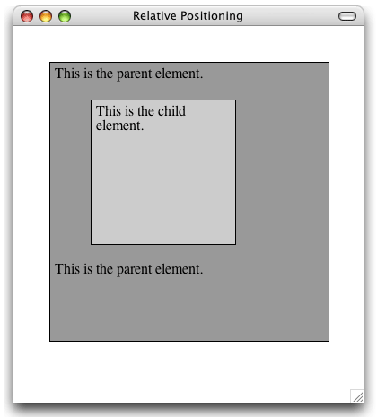
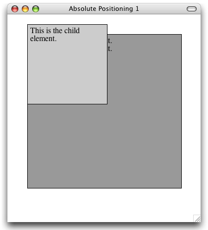
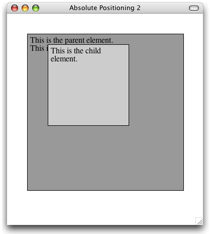

Layout
==========

---
Das Box Modell
--------------

<small> Quelle: <a href="http://de.selfhtml.org/css/formate/box_modell.htm">SelfHTML</a> </small>

---
Aussen-Abstand: Margin
------------------------------

Aussen-Abstand oben/rechts/unten/links

`margin-[top|right|bottom|left]: [Abstandsangabe|auto|inherit]`

Abstände rechts/links aneinandergrenzender Elemente werden addiert
Abstände oben/unten aneinandergrenzender Elemente werden nicht addiert sondern der größere Abstand gilt 

`auto` oben/unten bewirkt Abstand `0`
`auto` links bewirkt rechtsbündige Position
`auto` rechts und links bewirkt Zentrierung

`margin-top:10px; margin-bottom:10px`

---
Aussen-Abstand: Margin
----------------------------

	!css
	margin:10px
	margin:10px 5px 10px 5px

Außenrand/Abstand oben/rechts/unten/links

`margin:[Angabe 1] ... [Angabe 4]`

* Eine Angabe für alle 4 Ränder
* Angabe für oben/unten und rechts/links
* Angabe für oben, rechts/links und unten
* Angabe für oben, rechts, unten und links

---
Innenabstand: Padding
-------------------

Innenabstand oben/rechts/unten/links

	!css
	padding-[top|right|bottom|left]:[Abstand]
	padding-top:10px; padding-bottom:10px
	padding:[Abstand 1] ... [Abstand 4]

* Eine Angabe für alle 4 Ränder
* Angabe für oben/unten und rechts/links
* Angabe für oben, rechts/links und unten
* Angabe für oben, rechts, unten und links

---
Rahmen: Border
------------
Rahmentyp
	
	!css
	border-[top|right|bottom|left]-style: [none|hidden|dotted|dashed|solid|double| groove|ridge|inset|outset]
	border-style:[Angabe 1] ... [Angabe 4]
	border-style:solid
	border-top-style:solid

Rahmenbreite

	!css
	border-[top|right|bottom|left]-width: [Rahmenbreite|thin|medium|thick]
	border-width:5px; border-top-width:5px
---
Rahmen: Border
------------
###Rahmenfarbe

	!css
	border-[top|right|bottom|left]-color: [Rahmenfarbe]
	border-color:blue; border-top-color:blue

###Rahmen gesamt

	!css
	border-[top|right|bottom|left]: [border-width border-style border-color]

Reihenfolge der Angaben ist egal

	!css
	border:5px solid red
	border-top:5px solid red

---
Rahmen: Border
-------------
Outline (Kontur)

Rahmen für nicht rechteckige Bereiche (Textfluss) Unterschied zu `border`: Konturen werdenüber dem Element gezeichnet, daher keinen eigenen Platz Outline-Rahmen können nur vollständig geschlossen gezeichnet werden

	!css
	outline-width: [Rahmenbreite]
	outline-style: [Rahmentyp]
	outline-color: [Rahmenfarbe]
	outline: [width style color]
---
Hintergrundfarben und -bilder
-----------------------------------------

Hintergrundfarbe

	!css
	background-color:[Farbe]

Hintergrundbild

	!css
	background-image:url([URI])

Wiederholung Hintergrundbild

	!css
	background-repeat:[repeat|repeat-x|repeat-y|no-repeat]

Wasserzeichen-Effekt

	!css
	background-attachment:[scroll|fixed]

---
Hintergrundfarben und -bilder
------------------------------------------

Hintergrundposition

	!css
	background-position:[left|center|right] [top|center|bottom]
	background-position: left top;

Hintergrund gesamt

	!css
	background:[background-color	background-image	background-repeat	
	   background-attachment	background-position]
	
	background:url(wi-team-1.jpg) no-repeat fixed center;

---
Größe von Elementen
--------------------------------
Angabe von Breite und Höhe

`width:[Breite|auto]` Breite des Elements  
`min-width:[Breite]` Mindestbreite des Elements  
`max-width:[Breite]` Maximalbreite des Elements  

`height:[Höhe|auto]` Höhe des Elements  
`min-height:[Breite]` Mindesthöhe des Elements  
`max-height:[Breite]` Maximalhöhe des Elements  

---
Position von Elementen
----------------------------------

Art der Positionierung

	!css
	position: [static|relative|absolute|fixed]

`static` normaler Elementfluss (Normalposition)  
`relative` relativ zur Normalposition (Verschieb.)  
`absolute` absolute Position (zum nächsthöheren _nicht static_ positionierten Element)  
`fixed` absolute Position (zum Browserfenster) bleibt beim Scrollen stehen  

Mit `absolute` oder `fixed` positionierte Elemente sind nicht Teil des Elementflusses  

Angabe der Position

`top:[Abstand|auto]` Position von oben  
`left:[Abstand|auto]` Position von links  
`bottom:[Abstand|auto]` Position von unten  
`right:[Abstand|auto]` Position von rechts  

---
Anzeige von Elementen
----------------------------------

### Anzeige von übergroßem Inhalt

	!css
	overflow:[visible|hidden|scroll|auto]

`visible` Inhalt ragt aus Element heraus   
`hidden` Inhalt wird abgeschnitten   
`scroll` abschneiden + scrollen   
`auto` Web-Browser entscheidet  

### Textfluss

	!css
	float:[left|right|none]

Element steht links/rechts und wird von nachfolgendem Text umflossen

	!css
	clear:[left|right|both|none]

Textumfluss wird abgebrochen und nachfolgender Text beginnt unterhalb des Elements

---
Anzeige von Elementen
----------------------------------

###Ebene bei Überlappung

	!css
	z-index:[Ebene];
	z-index:3;

###Art der Anzeige
	
	!css
	display:[block|inline|inline-block|list-item|run-in|none]

> `block` Anzeige als Block  
> `inline` Anzeige im Textfluss  
> `inline-block` Block im Textfluss  
> `list-item` Block mit Bullet  
> `run-in` kontextabhängig  
> `none` Keine Anzeige  
---
Anzeige von Elementen
----------------------------------

	!css
	visibility:[visible|hidden|collapse]

> `visible` 		sichtbar  
> `hidden`		versteckt (Platzhalter)  
> `collapse`	Tabelle gibt Platz frei  

Unterschied zwischen `visibility: hidden` und `display: none`: Berechnung der Position anderer Elemente!

---
Positionierung: Relativ
---------------------------------

.fx: column2

	!html
	<html>
	<head>
	<title>Relative Positioning</title>
	
	</head>
	<body>
	

	
This is the parent element.

	

	
This is the child element.

	

	
This is the parent element.

	

	</body>
	</html>

	

---
Positionierung: Absolut 
---------------------------------
.fx: column2

	!html
	<html>
	<head>
	<title>Absolute Positioning 1</title>
	
	</head>
	<body>
	

	
This is the parent element.

	

	
This is the child element.

	

	
This is the parent element.

	

	</body>
	</html>

	

---
Positionierung: Absolut #2
---------------------------------

.fx: column2

	!html
	<html>
	<head>
	<title>Absolute Positioning 2</title>
	
	</head>
	<body>
	

	
This is the parent element.

	

	
This is the child element.

	

	
This is the parent element.

	

	</body>
	</html>

	

---
Layout Methoden
-------------------------

### Veraltete Methoden des Seitenlayouts

* Frames  
	* „Deprecated“: kein gültiges HTML in der Variante Strict
* Tabellenbasiertes Seitenlayout   
	* Verletzt die Trennung zwischen Inhalt und Layout

Beide Varianten ermöglichen keine Anpassung an Smartphones/Tablets!!

### CSS-basiertes Seitenlayout  
> ➔ Flexible Definition der Anordnung der Elemente einer Seite  
> ➔ Erleichtert die Pflege der Seiten  
> ➔ Ermöglicht alternative Layouts  
> ➔ Reduziert den Umfang des HTML-Codes  

---
Layout: Elemente nebeneinander
------------------------------

## Simples 2 Spalten Layout
Block-Elemente werden mittels **width**, **float** und **margin** als unabhängige Boxen untereinander oder nebeneinander angeordnet.

## Beispiel: Zwei Elemente nebeneinander:

	!html
	
Dies ist eine Box mit Text

	
Eine zweite Box mit Text

	

	
Dies ist eine Box mit Text

	
Eine zweite Box mit Text

	
Dies ist eine Box mit Text

	
Eine zweite Box mit Text

	

	
Dies ist eine Box mit Text

	
Eine zweite Box mit Text

	&nbsp;

---
Layout: 2 Spalten
------------------

Problem: Eine Box feste größe, andere Box rest des Bildschirms

	!html
	

	Dies ist eine Box mit Text

	

	Eine zweite Box mit Text

	
<ul><li>Menüpunkt 1</li><li>Menüpunkt 2</li><li>Menüpunkt 3</li><li>Menüpunkt 4</li></ul>

	
Eine zweite Box mit Text

Achtung: Margin wirkt nur bei nicht-float!

---
3 Spalten Layout
------------------------

	!html
	<h1>Überschrift</h1>
	<ul id="navigation">...</ul>
	
...

	
...

	
Fußzeile

[4] (Reihenfolge von außen nach innen)

CSS:

	!css
	#navigation {
		float:left;
		width:150px;
	}
	#info {
		float:right;
		width:150px;
	}
	#inhalt {
		margin:0px 160px; /* link und rechts 160px */
	}
	#footer {
		clear:both;
	}

---
Dreispaltiges Layout
--------------------

<h1>Überschrift</h1>
<ul id="navigation">
	<li>Menüpunkt 1</li>
	<li>Menüpunkt 2</li>
	<li>Menüpunkt 3</li>
	<li>Menüpunkt 4</li>
</ul>

Infobox

Etwas Inhalt  lala

Fußzeile

### Probleme
- Keine gleichmäßige Höhe
- Feste Größenangaben

---
Layout-Templates
----------------

* <a href="http://www.noupe.com/css/9-timeless-3-column-layout-techniques.html">9 Timeless 3 Column Layout Techniques</a>
* <a href="http://matthewjamestaylor.com/blog/perfect-3-column.htm">The Perfect 3 Column Liquid Layout</a>  No CSS hacks. SEO friendly. No Images. No JavaScript. Cross-browser & iPhone compatible.

Layout Frameworks:

* <a href="http://960.gs/">960 Grid System</a> 
* <a href="blueprintcss.org">Blueprint</a> 
* <a href="http://yaml.de">YAML: Yet Another Multicolumn Layout</a> Ein (X)HTML/CSS Framework (ACHTUNG: Lizenz)
* <a href="http://www.noupe.com/css/5-popular-css-frameworks-tutorials-tools-for-getting-started.html">5 Popular CSS Frameworks - Getting Started</a>

### <a href="http://www.highresolution.info/spotlight/entry/was_sie_ueber_css-frameworks_wissen_sollten/">Was Sie über CSS-Frameworks wissen sollten!</a>

### ACHTUNG: Die Frameworks dürfen im Projekt nicht verwendet werden! Simple Templates hingegen schon, ihr solltet allerdings verstehen was diese bewirken! (Wird u. U. abgeprüft in der mündlichen Prüfung)!

---
Navigationsleisten
------------------

	!html
	<ul id="navigation">
		<li>Menüpunkt
			<ul><li>Unterpunkt</li></ul>
		</li>
	</ul>

CSS:

	!css
	#navigation li {
		list-style:none;
	}

	#navigation li ul {
	margin:0px 0px 0px 20px;
	font-size:0.8em;
	display:none;  /* Unterpunkte werden zunächst nicht angezeigt */
	}

	#navigation li:hover ul {
	display:block; /* Unterpunkte werden angezeigt */
	}

---
Navigationsleisten: Horizontal
------------------------------

### Horizontale Navigationsleisten

	!css
	#navigation li {
		float:left;			/* bewirkt horizontale Anordnung */
		position: relative; /*ermöglicht Positionierung der Unterpunkte*/
	} 

	#navigation +div {
		clear:left; /* Aufhebung des Umflusses am Ende der Navigationsleiste*/
	}

	#navigation li ul {
		position:absolute; 	/* Positionierung der Unterpunkte relativ zum Oberpunkt */
		top:10px;
		left:0px;
	}

