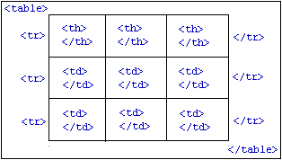
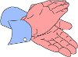

HTML "Advanced"
=============
---
Inhalt
-------
- (I)-Frames
- Tabellen
- Formulare

---
Frames
------
- **Veraltete Technik** die für das Layout eingesetzt wurde.
- Mehrere HTML Seiten gleichzeitig darstellen

---
Frames: Nachteile
-----------------

- Problem der Unterstützung nicht framefähiger Browser (Heute: vernachlässigbar!)
- Problem bei der Verlinkung auf untergeordnete Seiten (deep links, Lesezeichen)
- Verletzung des URI Prinzips (Jede Information besitzt eine unabhängige URI)
- Frames sehr problematisch als Mittel zum Seitenlayout
	- Limitierte Gesaltungsmöglichkeiten
- **Kein modernes Layout setzt auf Frames!**

---
I-Frames
--------
### Anzeigen fremder Quellen (HTML-Dateien)

	!html
	<iframe src="[URI]" width="[Breite]" height="[Höhe]"
	name="[Name]" align="[left|right]" 	scrolling="[auto|yes|no]"
	frameborder="[1|0]" longdesc="[URI]">
	[Alternativtext]</iframe>

Der Inhalt eingebetteter Frames kann durch Verweise geändert werden

	!html
	<a href="[URI]" target="[Name des iframes]">

### Einsatzzwecke
- Facbeook integration
- Youtube Videos (HTML5)
- Verschiedenste Widgets von Drittanbietern

---
HTML Tabellen
-------------
- Tabellarische Darstellung von Daten
- *KEIN* Grundgestaltungsmittel für Seiten-Layouts
- Anordnung von Informationen ist sowohl ein Aspekt der Strukturierung als auch der Gestaltung
	- Verstößt eigentlich gegen Trennung von Inhalt/Struktur und Gestaltung, aus praktischen Gründen akzeptiert

### HTML-Elemente zum Aufbau einer Tabelle

---
HTML Tabelle
------------
<table border="1">
  <tr>
    <th>Berlin</th>
    <th>Hamburg</th>
    <th>M&uuml;nchen</th>
  </tr>
  <tr>
    <td>Milj&ouml;h</td>
    <td>Kiez</td>
    <td>Bierdampf</td>
  </tr>
  <tr>
    <td>Buletten</td>
    <td>Frikadellen</td>
    <td>Fleischpflanzerl</td>
  </tr>
</table>

	!html
	<table border="1">
	  <tr>
		<th>Berlin</th>
		<th>Hamburg</th>
		<th>M&uuml;nchen</th>
	  </tr>
	  <tr>
		<td>Milj&ouml;h</td>
		<td>Kiez</td>
		<td>Bierdampf</td>
	  </tr>
	  <tr>
		<td>Buletten</td>
		<td>Frikadellen</td>
		<td>Fleischpflanzerl</td>
	  </tr>
	</table>

---
Tabellen Spalten definieren
------------

### Spalten vordefinieren
	!html
	<table>
	<colgroup>
	<col width="100">
	<col width="200">
	<col width="50" span="3">
	</colgroup>
	<tr> ...
	<table>
	<colgroup width="50%" span="2"></colgroup>
	<tr> ...

- colgroup kann mehrfach vorkommen
- Angaben in col überschreiben Angaben in colgroup

---
Logische Bereiche einer Tabelle
-------------------------------

Kopf, Körper und Fuß einer Tabelle

	!html
	<table>
	<thead> <th> ... </th> ... </thead>
	<tfoot> <td> ... </td> ... </tfoot>
	<tbody> <td> ... </td> ... </tbody>
	</table>

- Kopf und Fuß können maximal einmal vorkommen und werden üblicherweise bei umgebrochenen Tabellen auf jeder Seite wiederholt
- Der Körper kann beliebig oft vorkommen Logische Bereiche einer Tabelle können anschließend mittels CSS formatiert werden

---
HTML-Elemente einer Tabelle
---------------------------

- Kindelemente `table`: `col, colgroup, thead, tfoot, tbody, tr`
- Attribute `table` (Besser: CSS!)
	- border: Rahmenbreite (border="0")
	- width: Breite der Tabelle (width="100%") [Auch in tr für Spaltenbreite]
- Kindelemente th/td: Block- oder Inline-Elemente
- Tabellen können beliebig verschachtelt werden
- Tabellen sollten **nicht** zur Strukturierung ganzer Webseiten verwendet werden

---
CSS Eigenschaften von Tabellen
------------------------------

	!css
	.staetetab {
		border: 1px solid #000;
		border-collapse: collapse;
		border-spacing: 10px; /* Keine Wirkung mit border-collapse: collapse */
	}
	.staetetab td {	border: 1px solid green; }
	.staetetab tr:first-child {	height: 100px; }
	.staetetab tr th:first-child {	width: 150px; }
	.staetetab td, .staetetab th {	padding: 10px;	}

	<table class="staetetab">
	  <tr>
		<th>Berlin</th>
		<th>Hamburg</th>
		<th>M&uuml;nchen</th>
	  </tr>
	  <tr>
		<td>Milj&ouml;h</td>
		<td>Kiez</td>
		<td>Bierdampf</td>
	  </tr>
	  <tr>
		<td>Buletten</td>
		<td>Frikadellen</td>
		<td>Fleischpflanzerl</td>
	  </tr>
	</table>

<a href="http://www.thestyleworks.de/basics/tables.shtml">The Styleworks: Tabellenformatierung mit CSS</a>

---
Zellen verbinden
----------------
- Zellen einer Zeile verbinden
	- `colspan="[Spaltenzahl]"` in erster Zelle angeben 
	  Zahl der Zellen der Zeile reduziert sich um Spaltenzahl-1
- Zellen einer Spalte verbinden
	- `rowspan="[Zeilenzahl]"` in erster Zelle angeben 
	   Zahl der Zellen der folgenden Zeilenzahl-1 Zeilen reduziert sich jeweils um eins
- Zellen spalten- und zeilenweise verbinden: Kombination der Attribute `colspan` und `rowspan`
- Zellen verbingen = Strukturbeinflussung, daher in HTML; nicht in CSS

---
Zellen verbinden #2
-------------------

	!html
	<table border="1">
	  <tr>
		<td rowspan="2">Basiszahlen</td>
		<td>200 &euro;</td>
	  </tr>
	  <tr>
		<td>400 &euro;</td>
	  </tr>
	  <tr>
		<td colspan="2">Sonstige Informationen</td>
	  </tr>
	</table>

<table border="1">
  <tr>
	<td rowspan="2">Basiszahlen</td>
	<td>200 &euro;</td>
  </tr>
  <tr>
	<td>400 &euro;</td>
  </tr>
  <tr>
	<td colspan="2">Sonstige Informationen</td>
  </tr>
</table>

---
Weitere Attribute für Tabellen
------------------------------
		
- Überschrift: `<caption>Überschrift</caption>`
	- `<caption align="[left, right]">...</caption>`
	- `<caption align="bottom">...</caption>`

- Zusammenfassung des Inhalts `<table summary="[Zusammenfassung]">`
- Kurzbeschreibung für Zellen `<th/td abbr="[Kurzbeschreibung]">`
- Referenzen auf Kopfzellen
	- Identifikation der Kopfzellen mittels `<th id="[ID]">`
	- Bezugnahme auf Kopfzellen mittels `<td headers="[ID]">`
- Kategoriennamen für Tabellenzellen `<th/td axis="[Kategorie]">`
- Verwendung von Zusatzinformationen
	- Ausgabe auf nicht-visuellen Medien (z.B. Sprachausgabe)
	- Formatierung mittels CSS

Wiederholung der Kopfinformationen in Datenzellen

---
Formulare in HTML
---------

- Formulare ermöglichen
	- Die strukturierte Erfassung von Daten durch den Nutzer
		- Eingabefelder/Textfelder, Auswahlelemente, etc.
	- Das Senden der Daten an die Web-Applikation bzw. den Betreiber
	- Die Interaktion des Nutzers mit der Web-Applikation

- Formularbereiche
	- `<form>...</form>`
	- Innerhalb des form-Elements
		- Eingabefelder des Formulars
		- beliebige Block-Elemente zur Anordnung und Beschriftung der Eingabefelder

---
Verarbeitung von Formularen
---------------------------

### Verarbeitung der Formularinhalte
- Attribut action definiert ein Programm zur Weiterverarbeitung der Daten des Formulars
	- `<form action="[URI]">`
	- Verarbeitung mittels der CGI-Schnittstelle (z.B. Perl / PHP Skript)
- Attribut method definiert Übertragungsmethode
	- `method="get"`
		- Formulardaten werden beim Aufruf als Parameter angehängt
			http://www.homepage.de/cgi-bin/test.cgi?Name=Mustermann&Vorname=Max
	- `method="post"`
		- Übergabe der Daten an das verarbeitende Programm über die Standardeingabe (z.B. bei umfangreichen Formulardaten)
	- W3C-Empfehlung: get für temporäre Daten, post für persistente Daten

---
Kodierung der Formulardaten
----
- Attribut accept-charset definiert die verwendete Kodierung für Formulardaten
- Kodierung sollte übereinstimmen mit Angaben im HTTP-Header (Serverkonfiguration) und Meta-Tag der HTML-Datei

## Beispiel

	!html
	<form action="mailto:..." enctype="text/plain" 
	method="post" accept-charset="UTF-8">

Anmerkung: `action="mailto:mail@domain.de"` ruft auf dem Rechner das E-Mail Programm auf und ermöglicht so das vorherige ausfüllen von E-Mails auf der Webseite. Nicht mehr gebräuchlich, die E-Mails werden heute vom Webserver gesendet (z. B. PHP mail()).

---
Formularfelder: Eingabe
--------------

### Einzeilige Eingabefelder
	
	!html
	<input type="text" name="[Name]" size="[Size]"
	maxlength="[maxlength]" value="[Vorbelegung]">
	<!-- Beispiel Beruf: -->
	<input name="Beruf" type="text" size="20" maxlength="30">

<input name="Beruf" type="text" size="20" maxlength="30" value="Informatiker" />

### Eingabefelder für Passwörter

	!html
	<input type="password" name="[Name]" size="[Size]" 
	maxlength="[maxlength]" value="[Vorbelegung]">

<input name="pw" type="password" value="Geheim" />

---
Formularfelder: Eingabe
--------------

### Mehrzeilige Eingabefelder

	!html
	<textarea name="[Name]" rows="[Zeilen]" 
	cols="[Spalten]">[Vorbelegung]</textarea>

<textarea name="dmeo" rows="3" cols="60">Das ist ein
wenig Text.</textarea>

- Text als Vorbelegung innerhalb des textarea-Elements wird so dargestellt wie er eingegeben wurde HTML-Sonderzeichen sind zu maskieren (`&amp;lt;` `&amp;gt;` `&amp;amp;`)
	- Es sind keine weiteren HTML-Elemente erlaubt
- Zeilenumbruch verhindern: `wrap="off"`
- Readonly Eingabefelder: `readonly`

---
Formularfelder: Buttons
------------------------
### Buttons
	!html
	<input type="button" name="[Name]" value="[Beschriftung]" [Event-Handler]>
	<button type="button" name="[Name]"	value="[Beschriftung]" [Event-Handler]>
	[beliebiger HTML-Code als Beschriftung (keine Verweiselemente)]</button>

### Beispiel: Button mit Graphik

	!html
	<button type="button" name="Button" value="hier klicken" onclick="alert('Bravo')">
	 Spitze</button>

<button type="button" name="Button" value="hier klicken" onclick="alert('Bravo')"> Spitze</button>

---
Formularfelder: Absenden
------------------------
### Buttons zum Absenden oder Abbrechen

	!html
	<input type="[submit/reset]" name="[Name]" value="[Beschriftung]">

### Beispiel

	!html
	<input type="submit" name="Button" value="Absenden">
	<input type="image" src="wi-team-1.jpg" width="100" 
	height="70" name="Button" alt="Absenden">

### Neben dem value werden bei `button` auch die Koordinaten des Klicks innerhalb des Bildes übertragen

	!html
	<button type="submit" name="Button" value="Absenden">Absenden</button>

---
Formularfelder: Auswahliste
----------------------------
### Auswahllisten

	!html
	<select name="[Name]" size="[Zahl Einträge]">
	<option>[Eintrag]</option>
	...
	</select>

`size="1"` ergibt eine Dropdown-Liste
Beispiel

	!html
	<select name="Auswahlliste" size="1">
		<option>Eintrag 1</option>
		<option>Eintrag 2</option>
		<option>Eintrag 3</option>
		<option>Eintrag 4</option>
	</select>

	<select name="Auswahlliste" size="1">
		<option>Eintrag 1</option>
		<option>Eintrag 2</option>
		<option>Eintrag 3</option>
		<option>Eintrag 4</option>
	</select>

---
Formularfelder: Auswahliste
----------------------------

- Attribut multiple ermöglicht eine Mehrfachauswahl
- Attribut selected im option-Element ermöglicht Vorauswahl
- Attribut value="[Absendewert]" ermöglicht die Definition eines speziellen Absendewerts

### Beispiel

	!html
	<select name="Auswahlliste" size="3" multiple>
		<option value="1" selected>Eintrag 1</option>
		<option value="2">Eintrag 2</option>
		<option value="3">Eintrag 3</option>
		<option value="4">Eintrag 4</option>
	</select>

	<select name="Auswahlliste" size="3" multiple>
		<option value="1" selected>Eintrag 1</option>
		<option value="2">Eintrag 2</option>
		<option value="3">Eintrag 3</option>
		<option value="4">Eintrag 4</option>
	</select>

---
Formulare: Verschachtelte Auswahllisten
----------------------------

### `optgroup` erlaubt die Gruppierung von Elementen einer Auswahlliste
Beispiel

	!html
	<select name="Verschachtelte_Auswahlliste" size="1">
		<optgroup label="Gruppe 1">
			<option label="Eintrag_1">Eintrag 1</option>
			<option label="Eintrag_2">Eintrag 2</option>
		</optgroup>
		<optgroup label="Gruppe 2">
			<option label="Eintrag_3">Eintrag 3</option>
			<option label="Eintrag_4">Eintrag 4</option>
		</optgroup>
	</select>

	<select name="Verschachtelte_Auswahlliste" size="1">
		<optgroup label="Gruppe 1">
			<option label="Eintrag_1">Eintrag 1</option>
			<option label="Eintrag_2">Eintrag 2</option>
		</optgroup>
		<optgroup label="Gruppe 2">
			<option label="Eintrag_3">Eintrag 3</option>
			<option label="Eintrag_4">Eintrag 4</option>
		</optgroup>
	</select>

---
Formularfelder: Radio Buttons
---------------------------

	!html
	<input type="radio" name="[Name]" value="[Wert]">

- Radio-Buttons mit dem gleichen Namen gehören zu einer Gruppe
- Attribut `checked` ermöglicht die Vorauswahl eines Buttons

### Beispiel
	!html
	<input type="radio" name="Geschlecht" value="m"	checked>männlich 
	<input type="radio" name="Geschlecht" value="w">weiblich 

	<input type="radio" name="Geschlecht" value="m"	checked>männlich 
	<input type="radio" name="Geschlecht" value="w">weiblich 

---
Formularfelder: Checkboxen
---------------------------

	!html
	<input type="checkbox" name="[Name]"value="[Wert]">

Checkboxen mit dem gleichen Namen gehören zu einer Gruppe Attribut checked ermöglicht die Vorauswahl einer Checkbox 

	!html
	<input type="checkbox" name="Hobbies" value="lesen" checked> lesen 
	<input type="checkbox" name="Hobbies" value="kochen"> kochen 
	<input type="checkbox" name="Hobbies" value="studieren"> studieren 

<input type="checkbox" name="Hobbies" value="lesen" checked> lesen 
<input type="checkbox" name="Hobbies" value="kochen"> kochen 
<input type="checkbox" name="Hobbies" value="studieren"> studieren 

---
Datei-Upload / Versteckte Felder
---------------------------
### Datei-Upload
	!html
	<input type="file" name="[Name]" size="[Feldlänge]">
Funktioniert nur in Verbindung mit method="post" und enctype="multipart/form-data"

	<input type="file" name="ul">

### Versteckte Felder
	!html
	<input type="hidden" name="[Name]">

- Können zur Speicherung und Übertragung von Daten an die Server-Applikation verwendet werden
- Der Inhalt versteckter Felder kann z.B. mittels Java-Skript verändert werden

---
Formular: Elementgruppen
------------------------

Elementgruppen

	!html
	<fieldset>
	<legend>[Überschrift]</legend>
	[Felder der Gruppe]
	</fieldset>

Beispiel

	!html
	<fieldset>
	<legend>Überschrift</legend>
	<input type="checkbox" name="Checkbox"
	value="Wert_1"> Wert 1 
	<input type="checkbox" name="Checkbox"
	value="Wert_2"> Wert 2 
	<input type="checkbox" name="Checkbox"
	value="Wert_3"> Wert 3 
	</fieldset>

	<fieldset>
	<legend>Überschrift</legend>
	<input type="checkbox" name="Checkbox"
	value="Wert_1"> Wert 1 
	<input type="checkbox" name="Checkbox"
	value="Wert_2"> Wert 2 
	<input type="checkbox" name="Checkbox"
	value="Wert_3"> Wert 3 
	</fieldset>

---
Formular: Labels
----------------

Label für Felder

	!html
	<label for="[ID]">[Beschriftung]</label>
	<input id="[ID]" ... >

Beschriftung wird einem Feld eindeutig über dessen ID zugeordnet

	!html
	<label for="Vorname">Vorname: </label>
	<input id="Vorname" name="Vorname" type="text"
	size="20" maxlength="30"> 
	<label for="Nachname">Nachname: </label>
	<input id="Nachname" name="Nachname"
	type="text" size="20" maxlength="30">

	<label for="Vorname">Vorname: </label>
	<input id="Vorname" name="Vorname" type="text"
	size="20" maxlength="30"> 
	<label for="Nachname">Nachname: </label>
	<input id="Nachname" name="Nachname"
	type="text" size="20" maxlength="30">

---
Formular Eigenschaften
----------------------

- Tabulator-Reihenfolge
	- Das Attribut tabindex in den Fomularelementen `input`, `textarea`, `select` oder `button` erlaubt die Definition der Tabulator-Reihenfolge
	- Die Tabulator-Reihenfolge sollte *konsistent* für alle auswählbaren Elemente einer HTML-Seite definiert werden (Verweise, Graphiken, Objekte, Formularelemente)
- Tastaturkürzel
	- Das Attribute `accesskey` in den Formularelementen `input, textarea, label, legend` und `button` definiert ein Zeichen zum Auswählen eines Formularelementes
- Disabled Elemente
	- Das Attribut `disabled` ermöglich das disablen von Elementen (erlaubt in `input, textarea, select, option, optgoup, button`)

---
Formular Demo
-------------

	<form action="http://lookthis.de/test.php" method="POST" target="_blank">
		<input type="hidden" name="unsichtbare_id" value="3" />
		<fieldset>
		<legend>Persönliches</legend>
		<label for="Vorname">Vorname: </label>
		<input id="Vorname" name="Vorname" type="text" size="20" maxlength="30"> 
		<label for="Nachname" tabindex="1">Nachname: </label>
		<input id="Nachname" name="Nachname" type="text" size="20" maxlength="30"> 
		<label for="Strasse">Strasse: </label>
		<input id="Strasse" name="Strasse" type="text" size="20" maxlength="30"> 
		<label for="Hausnummer">Hausnummer: </label>
		<input id="Hausnummer" value="150" name="Hausnummer" type="text" size="20" maxlength="30" disabled> 
		</fieldset>
		<fieldset>
		<legend>Hobbys</legend>
		<input type="checkbox" name="Hobbys[]" value="radfahren" checked> Radfahren 
		<input type="checkbox" name="Hobbys[]" value="schwimmen"> Schwimmen 
		<input type="checkbox" name="Hobbys[]" value="lesen"> Lesen 
		</fieldset>
		<fieldset>
		<legend>Geschlecht</legend>
		<input type="radio" name="Geschlecht" value="m"	checked>männlich 
		<input type="radio" name="Geschlecht" value="w">weiblich 
		</fieldset>
		<input type="submit" name="submit" value="Absenden">
		<input type="reset" name="reset" value="Reset">
	</form>

---
Formular: Demo Source
---------------------

	!html
	<form action="http://lookthis.de/test.php" method="POST" target="_blank">
		<input type="hidden" name="unsichtbare_id" value="3" />
		<fieldset>
		<legend>Persönliches</legend>
		<label for="Vorname">Vorname: </label>
		<input id="Vorname" name="Vorname" type="text" size="20" maxlength="30"> 
		<label for="Nachname" tabindex="1">Nachname: </label>
		<input id="Nachname" name="Nachname" type="text" size="20" maxlength="30"> 
		<label for="Strasse">Strasse: </label>
		<input id="Strasse" name="Strasse" type="text" size="20" maxlength="30"> 
		<label for="Hausnummer">Hausnummer: </label>
		<input id="Hausnummer" value="150" name="Hausnummer" type="text" size="20" maxlength="30" disabled> 
		</fieldset>
		<fieldset>
		<legend>Hobbys</legend>
		<input type="checkbox" name="Hobbys[]" value="radfahren" checked> Radfahren 
		<input type="checkbox" name="Hobbys[]" value="schwimmen"> Schwimmen 
		<input type="checkbox" name="Hobbys[]" value="lesen"> Lesen 
		</fieldset>
		<fieldset>
		<legend>Geschlecht</legend>
		<input type="radio" name="Geschlecht" value="m"	checked>männlich 
		<input type="radio" name="Geschlecht" value="w">weiblich 
		</fieldset>
		<input type="submit" name="submit" value="Absenden">
		<input type="reset" name="reset" value="Reset">
	</form>

---
HTML und XHTML
-----

- SGML- Standard Generalized Markup Language
	- Standardisierte (Meta)-Auszeichnungssprache
	- Erlaubt die Definition spezifischer Auszeichnungssprachen mittels
	- DTDs (Document Type Definitions)
		- Eine DTD legt fest, aus welchen Elementen/Tags und Attributen eine konkrete Auszeichnunssprache besteht
		- HTML ist eine SGML-basierte Auszeichnungssprache
- XML – Extensible Markup Language
	- Vereinfachte Variante von SGML
	- Auch XML erlaubt die Definition konkreter Auszeichnungssprachen mittels DTDs (oder Schemata)

---
HTML vs XHTML 
-------------

- Definition von HTML mittels XML (anstelle von SGML)
- XHTML ist eine XML-basierte Auszeichnungssprache mit dem gleichen
- Sprachumfang wie HTML
	- XHTML 1.0 entspricht HTML 4.0
	- HTML5 kann sowohl als XML oder als SMGL definiert werden (Umgangssprachlich: HTML5 / XHTML5)

###Vorteile von XHTML
- Kompatibilität zu anderen XML-basierten Auszeichnungssprachen (e.g. WML, XSL, etc.)
- Ermöglicht Zugriff auf XHTML-Dokumente via DOM (Document Object Model)

---
Verarbeitung von XHTML im Browser
---------------------------------

- Zwei Arten der Verarbeitung von XHTML
	- Als XML (mittels des XML-Parsers des Browsers)
	- Als HTML (mittels des HTML-Parsers des Browsers)
- MIME-Typen für XHTML
	- `text/html` (Verarbeitung als HTML-Datei)
	- `text/xml` oder application/xml (... als normale XML-Datei)
	- `application/xhtml+xml` (... als XHTML-Datei)
	- Wichtig: XML-Parser sind strenger als HTML-Parser
	- Ältere Browser unterstützen nur text/html
- Dateinamen
	- `.htm` oder `.html` (Verarbeitung als HTML-Datei)
	- `.xhtml` (... als XHTML-Datei)

---
Unterschied: Dokumenttyp-Deklaration
------------------------

### XHTML 1.0

	!html
	<?xml version="1.0" encoding="UTF-8" ?>
	<!DOCTYPE html PUBLIC "-//W3C//DTD XHTML 1.0 Strict//EN"
		   "http://www.w3.org/TR/xhtml1/DTD/xhtml1-strict.dtd">
	<html xmlns="http://www.w3.org/1999/xhtml">
	<!-- usw. -->

### XHTML5 (XHTML Variante von HTML5)

	!html
	<?xml version="1.0" encoding="UTF-8" ?>
	<html xmlns="http://www.w3.org/1999/xhtml">
	<!-- usw. -->

<a href="http://webkompetenz.wikidot.com/html-handbuch:xhtml-unterschiede#toc3">Quelle: HTML5 Handbuch</a>

---
Unterschied: Dokumenttyp-Deklaration #2
----

- XML-Deklaration `<?xml version="1.0" encoding="UTF-8" ?>`
- XML-Deklaration ist optional und sollte bei Verarbeitung als HTML-Datei weggelassen werden
- Dokumenttyp-Deklaration (s.o.) *
- Namensraumangabe
	- `<html xmlns="http://www.w3.org/1999/xhtml">`
- Groß-/Kleinschreibung
	- XML unterscheidet zwischen Groß- und Kleinschreibung
	- In XHTML werden alle Element- oder Attributnamen klein geschrieben

[*] <blockqoute style="font-weight: bold">Mit XHTML5 ändert sich die Lage insofern, als XHTML5 gar keine Dokumenttyp-Deklaration mehr fordert — aus dem einfachen Grund, weil für XHTML5 gar keine DTD existiert. XHTML5 ist lediglich eine XML-gerechte Variante von HTML5. Und HTML5 basiert nicht mehr auf Markup-Dokumenttyp-Deklarationen, sondern auf DOM-Datenstrukturen.</blockqoute> <a href="http://webkompetenz.wikidot.com/html-handbuch:xhtml-unterschiede#toc3">Quelle: HTML5 Handbuch</a>

---
Besonderheiten von XHTML
------------------------
- Standalone-Elemente
	- Standalone-Elemente werden mit “ /” als inhaltsleer gekennzeichnet (z.B. ` `)
- Elemente ohne Inhalt sollten nicht in obiger Notation sondern mit einem schließenden Tag notiert werden (z.B. `

`)
- Elemente mit optionalem Abschluss-Tag 
	- Notieren sie alle Elemente die Inhalt haben können mit einem schließenden Tag

- Alleinstehende Attribute
	- In XHTML muss allen Attributen ein Wert zugewiesen werden 
	- Alleinstehende Attribute (z.B. `checked`, `readonly`) werden in der Form notiert: 
	- `[attribut]="[attribut]"`

---
Besonderheiten von XHTML #2
----------------------------
- Verweise zu Ankern
	- Anker in XHTML: Universalattribute `id` statt `name` (beide Notationen möglich)
	- Beispiel: `<a id="[Anker]" name="[Anker]">...</a>`
- Script- und Stylesheet-Bereiche
	- Inhalte von `script` und `style` sind in XHTML PCDATA (statt CDATA) (Sonderzeichen müssen maskiert werden) Script- oder Stylesheet-Bereiche in CDATA einschließen

## `script` Tag in XHMTL
	!html
	

