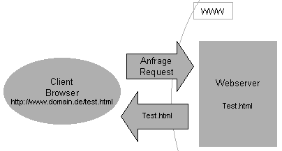
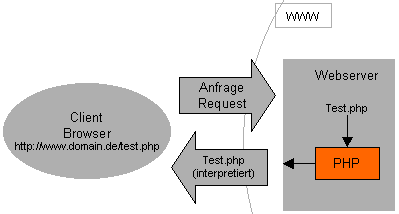

HTML & Semantik
===============

---
HTML-Kopfdaten
------
Meta-Angaben: Optional seit HTML 4.0 (zukünftig mittels RDF)

### Angaben für Web-Browser und Suchmaschinen

	!html
	<meta name="author" content="Leonie Mueller">

### Angaben für Web-Server (heute Auswertung meist erst durch Browser)

	!html
	<!-- HTML4 -->
	<meta http-equiv="content-type" content="text/html; charset=UTF-8">
	<!-- HTML5 -->
	<meta charset="UTF-8">

Meta-Angaben für heutige Suchmaschinen von geringer Bedeutung (aufgrund von Missbrauch)

	!html
	<meta name="description" content="Text erscheint als Beschreibung bei Suchmaschinentreffern">
	<meta name="keywords" content="Leonie ; Homepage">
	<meta name="date" content="2009-03-10T10:15:34+01:00">

---
HTML-Kopfdaten
---------------
###Mehrsprachige Meta-Angaben

	!html
	<meta name="description" lang="de" content="Text">
	<meta name="description" lang="en" content="Text">

###Angabe eines externen Profils für Meta-Angaben

	!html
	<head profile="http://dublincore.org/documents/dcq-html/">

###Angabe eines Schemas für eine Meta-Angabe

	!html
	<meta name="Typ" scheme="MIME-Type" content="text/html">

---
HTML-Kopfdaten
---------------

###Suchmaschinenzugriff erlauben/verbieten

	!html
	<meta name="robots" content="index, noindex, nofollow, all">

###Zeichenkodierung

	!html
	<meta http-equiv="content-type" content="text/html; charset=UTF-8">

### Script- und Stylesheet-Sprache 

	!html
	<meta http-equiv="Content-Script-Type" content="text/javascript">
	<meta http-equiv="Content-Style-Type" content="text/css">

---
HTML-Kopfdaten
---------------

###Gültigkeit von Zwischenspeichern (Browser-Cache, Proxy-Cache)

	!html
	<meta http-equiv="expires" content="0">
	<meta http-equiv="expires" content="Mon, 23 Mar 2009 12:00:00 GMT">

###Automatische Weiterleitung

	!html
	<meta http-equiv="refresh" content="3; URL=http://www.hs-weingarten.de/">

- Achtung: 
	- Weiterleitungen werden nicht von allen Browsern unterstützt 
	- Zeit 0 führt zum Festhängen auf der Seite beim „Zurück“-Button

---
Logische Beziehungen
--------------------
###Einbettung einer Hypertextdatei in ihren Kontext   
Darstellung der Abhängigkeiten zu anderen Dateien

	!html
	<link rel="next" title="Next" href="zweite_seite.html">

### Anerkannte Link-Arten
`contents, chapter, section, subsection, index,glossary, appendix, search, author, copyright,next, prev, first, last, up, top, help, bookmark,alternate stylesheet, alternate stylesheet, shortcut icon`

### Google stellt einige dieser Links in den Ergebnissen dar!

---
Dublin Core Metadata Initiative
--------------------------------

	!html
	<head profile="http://dublincore.org/documents/dcq-html/">
	  <title>Dublin Core</title>
	  <link rel="schema.DC"      href="http://purl.org/dc/elements/1.1/" />
	  <link rel="schema.DCTERMS" href="http://purl.org/dc/terms/" />
	  <meta name="DC.format"        scheme="DCTERMS.IMT"      content="text/html" />
	  <meta name="DC.type"          scheme="DCTERMS.DCMIType" content="Text" />
	  <meta name="DC.publisher"     content="Jimmy Wales" />
	  <meta name="DC.subject"       content="Dublin Core Metadaten-Elemente, Anwendungen" />
	  <meta name="DC.creator"       content="Björn G. Kulms" />
	  <meta name="DCTERMS.license"  scheme="DCTERMS.URI" content="http://www.gnu.org/copyleft/fdl.html" />
	  <meta name="DCTERMS.rightsHolder" content="Wikimedia Foundation Inc." />
	  <meta name="DCTERMS.modified" scheme="DCTERMS.W3CDTF" content="2006-03-08" />
	</head>

### <a href="http://de.wikipedia.org/wiki/Dublin_Core">WP: Dublin Core</a>

---
Microformats Metadata
---------------

	!html
	

	<a class="url" href="http://elearning.hs-weingarten.de">
	<abbr class="dtstart" title="2011-12-05T14:15+01:0000">
	December 5, 2011 2:15</abbr> – <abbr class="dtend" 
	title="2011-12-05T15:45+01:00">3:45pm</abbr> :  
	Webgrundtechnik Semantik Vorlesung at 
	H061</a>

	This is a lecture about the basic web concepts!

	
Tags: <a rel="tag" href="http://eventful.com/events/tags/web">
	web</a><a rel="tag" href="http://eventful.com/events/tags/html"> html</a>
	<a rel="tag" href="http://eventful.com/events/tags/js"> js</a>
	

	
This <a 
	href="http://microformats.org/wiki/hcalendar">hCalendar event</a> brought 
	to you by the <a href="http://microformats.org/code/hcalendar/creator">
	hCalendar Creator</a>.

<a class="url" href="http://elearning.hs-weingarten.de"><abbr class="dtstart" title="2011-12-05T14:15+01:0000">December 5, 2011 2:15</abbr> – <abbr class="dtend" title="2011-12-05T15:45+01:00">3:45pm</abbr> : Webgrundtechnik Semantik Vorlesung at H061</a>
This is a lecture about the basic web concepts!

Tags: <a rel="tag" href="http://eventful.com/events/tags/web">web</a><a rel="tag" href="http://eventful.com/events/tags/html"> html</a><a rel="tag" href="http://eventful.com/events/tags/js"> js</a>
 
This <a href="http://microformats.org/wiki/hcalendar">hCalendar event</a> brought to you by the <a href="http://microformats.org/code/hcalendar/creator">hCalendar Creator</a>.

### <a href="http://http://microformats.org/">Microformats.org</a>

---
HTML5 Metadata
---------------

- Zusammenfügen bisher nicht oder extern standardisierter Meta Angaben

### Vorgeschlagene <a href="http://wiki.whatwg.org/wiki/MetaExtensions">HTML5 Meta Extensions</a>

---
Java Script
==========

---
Java Script
-----------

- Standardisiert als ECMAScript (ECMA 262)
- Skriptsprache für das Web (ähnliche Synax wie C, Java)
- Einführung durch Netscape 1995
- Dynamisches genereiren von Inhalten möglich
- Moderne Webanwendungen (z. B. GMail) nutzen massiv JavaScript
- Der Name JavaScript stammt aus den damals populären Java-Applets und hat nichts mit der Java Virtual Machine zu tun!
- Ziele und Eigenschaften
	- Überprüfen von Eingaben
	- Manipulation von HTML-Dokumenten (dynamisches HTML)
	- Objektorientiert, dynamisch typisierend, klassenlos

---
Beispiel
--------
	!html
	<html>
	<head>
	
	</head>
	<body>

	<form>
		<input type="button" onclick="myfunction('Hello')" value="Call function">
	</form>

	</body>
	</html>

Quelle: <a href="http://www.w3schools.com/js/tryit.asp?filename=tryjs_function2">W3C Schools Demo</a>

---
Einbettung von JS
-----------------

In separaten Dateien

Datei quadrat.js:
	
	!js
	function Quadrat() {
	var Ergebnis = document.Formular.Eingabe.value *
	document.Formular.Eingabe.value; alert("Das Quadrat von " +
	document.Formular.Eingabe.value + " = " + Ergebnis);
	}

HTML-Datei:

	!html
	<head>
	<title>JavaScript-Test</title>
	
	</head>
---
JS: Allgemeine Regeln
---------------------
Anweisungen: 

	!js
	Quadrat = Zahl * Zahl;

Anweisungsblöcke:

	!js
	function SageQuadrat (x) {
		var Ergebnis = x * x; /* Kommentar: x mal x */
		alert(Ergebnis); }

- Selbstvergebene Namen (z. B. Variablen)
	- Beginnen mit Buchstaben
	- Einziges Sonderzeichen: _
	- Unterscheidung Groß-/Kleinschreibung
	- Reservierte Wörter beachten

Kommentare: `//, /* ... */`

---
Aufrufen von Javascript-Funktionen
----------------------------------
Event-Handler

Beispiel Button-Event

	!html
	<form name="Formular" action="">
	<input type="text" name="Eingabe" size="3">
	<input type="button" value="Quadrat errechnen"
	onclick="Quadrat()"> </form>

<form name="Formular" action=""> <input type="text" name="Eingabe" size="3"> <input type="button" value="Quadrat errechnen" onclick="Quadrat()"> </form>

Beispiel Body-Event

	!html
	<body onload="ZeitAnzeigen()">

---
Variablen
---------

- Definition von Variablen: var
	- Globale Variable:
		- var-Defintion außerhalb einer Funktion
		- Zuweisung ohne var-Definition
	- Lokale Variable:
		- var-Definition innerhalb einer Funktion
	- Namensregeln beachten

Beispiel

	!js
	var Hinweis = "Gleich werden Quadratzahlen ausgegeben";

---
JS: Objekte
------------
Vordefinierte Objekte   
Beispiel: Aktuelle Uhrzeit

	!js
	var Jetzt = new Date();
	var Stunden = Jetzt.getHours();
	var Minuten = Jetzt.getMinutes();
	document.write("<h2>Guten Tag!<\/h2><b>Es ist jetzt " + Stunden + " Uhr und " + Minuten
	+ " Minuten<\/b>");

Eigene Objekte über Funktionen   
Beispiel: Hintergrund wechseln

	!js
	function Farbe (R, G, B) { this.R = R; this.G = G; this.B = B; this.hex = "#";}
	function HintergrundWechseln () {
	var Hintergrund = new Farbe("E0", "FF", "E0");
	document.bgColor = Hintergrund.hex + Hintergrund.R + Hintergrund.G + Hintergrund.B; }

Verfügbarkeitsprüfung: `if (!document.images) {...} else {...}`

---
JS: Funktionen
--------------
Schlüsselwort und Parameter   
`function (param1, param2)`

Anweisungsblock  
`{}`
Optionaler Rückgabewert  
`return`

	!js
	function BruttoBetrag (Netto, Prozente)
	{ 
		var Ergebnis = Netto * (1 + (Prozente / 100));
		return Ergebnis; 
	}

---
JS: Operatoren
--------------

Zuweisungsoperator: `=`  
Vergleichsoperatoren: `<, <=, >, >=, ==, !=`  
Berechnungsoperatoren: `+, -, *, /, %`  
Logische Operatoren: `&&, ||, !`  
`if (!name)`: Wahr bei `void, null, 0, "", undefined`  
Zeichenkettenverknüpfung: `+`  

	!js
	var strasse = "Hauptstrasse" + " 42";

---
JS: Bedingte-Anweisungen
------------------------

Wenn-Dann-Abfrage

	!js
	if (Bedingung) {...} else {...}

Einfaches Entweder-Oder

	!js
	var erg = (Bedingung) ? "richtig" : "falsch"

Fallunterscheidung

	!js
	var Eingabe = window.prompt("Zahl eingeben: 1 – 4");
	switch (Eingabe) {
		case "1": alert("Sie sind sehr bescheiden"); break;
		case "2": alert("Sie sind ein aufrichtiger Zweibeiner"); break;
		case "3": alert("Sie haben ein Dreirad gewonnen"); break;
		case "4": alert("Gehen Sie auf allen Vieren und werden Sie bescheidener"); break;
		default: alert("Sie bleiben leider dumm"); break;
	}

---
JS: Schleifen
-----------

	!js
	/* While-Schleife */
	while (Bedingung){ ...}
	/* For-Schleife */
	for (var i = startwert; i <= endwert; i++) {...}
	/* Do-While-Schleife */
	do { ... } while(Bedingung)

- Kontrollfluss innerhalb der Schleife:    
	- `break;` => Schleife wird verlassen    
	- `continue;` => Nächster Schleifendurchlauf

---
Event-Handler
-------------

- Bindeglied zwischen HTML und JavaScript
- Definition über Attribute von HTML-Tags
- W3C legt fest, welche Handler für welche HTML-Elemente existieren
- Populäre Event-Handler
	- `onclick` (bei Anklicken z.B. von Buttons)
	- `onload` (nach Laden einer Datei, z.B. im Body-Element um sicherzustellen, dass Dokument vor Ausführung von Code geladen)

Beispielanbindung

	!html
	<input type="button" value="Quadrat errechnen" onclick="Quadrat()">

---
DOM
---

- Ziel: Standardisierung des Zugriffs auf HTML- und XML-Dokumente
- Standard wird von W3C gepflegt
- DOM Level 1 – 3
- Baumstruktur mit Objekten und Methoden
- Historische Probleme
	- Unterschiedliche Browser-Unterstützung
	- Historisch unterschiedliche Modelle (Netscape, IE)
	- Vergleich: http://www.webdevout.net/browser-support

---
DOM Beispiel
------------

Ermöglicht das manipulieren eine Webseite mit JavaScript

	!html
	<table>
	  <thead>
		<tr>
		  <th>Vorname</th>
		  <th>Name</th>
		</tr>
	  </thead>
	  <tbody>
		<tr>
		  <td>Donald</td>
		  <td>Duck</td>
		</tr>
	  </tbody>
	</table>

---
DOM: Beziehungen
----------------

###Kinder
Kinder von Knoten `table`: `thead`, `tbody`
	
	!js
	document.getElementById("...").firstChild;

###Geschwister
Knoten mit gemeinsamem Elternknoten `thead` und `tbody` sind Geschwister

	!js
	document.getElementById("...").nextSibling;

###Vater
`table` ist Vater von `thead`, `tbody`

	!js
	document.getElementById("...").parentNode;

---
DOM: Knotentypen
----------------
###Wurzelknoten des Dokuments: 
`document`

###Elementknoten 

Spezialisierung eines allgemeinen Knotens (node)  
Entspricht HTML-/XML-Element  
Text ist ebenfalls ein Knoten  

	!js
	el = document.getElementById("...");
	var text = el.nodeValue;

###Attribute
Attribute eines Elementknotens

	!js
	attr = document.getElementById("...").getAttribute("...");

Spezialisierte Typen, z.B. HTMLDivElement

---
DOM: Verarbeitung
-----------------

###Navigation
Definiert im DOM Core  
Methoden auf node-Objekt  
Bsp.: `firstChild, lastChild, parentNode, nextSibling`

DHTML: Erzeugen, verschieben, löschen:    
`createElement, appendChild, removeChild, replaceChild`

	!js
	var myH1 = document.createElement("h1");
	var myText = document.createTextNode("Eine sehr dynamische Seite");
	myH1.appendChild(myText);
	var Ausgabebereich = document.getElementById("Bereich");
	Ausgabebereich.appendChild(myH1);

Auslesen / Schreiben: `el.firstChild.nodeValue = "Test";`

---

PHP
====

---
PHP: Hypertext Preprocessor
------------

- Die populärste serverseitige Skriptsprache
- Syntax: Mischung aus Perl und C
- Früher: Einfache Skriptsprache; Heute: Durchaus ernsthafte Programmiersprache
- Vorteile: 
	- Schnelle Lernkurve, Web-Entwickler kommt oft schnelle zum Ziel
	- Fast überall verfügbar (Shared-Webhosting)
	- Sehr gute und leicht verständliche Doku
- Nachteile:
	- Sprache ist nicht sehr "sauber"
	- Läd ein Fehler zu machen

---
Serverseitige Skriptsprachen
----------------------------

	!html
	<html>
	<head>
	<title>Beispiel</title>
	</head>
	<body>
	<h1>Aktuelle Serverzeit</h1>
	<?php
		print time();
	?>
	</body>
	</html>

---
XAMPP
------
## PHP selber am lokalen Rechner testen

### All-in-One Serverpaket:

- Web-Server: Apache
	- MySQL
	- PHP
	- phpMyAdmin
	- Download: <a href="http://www.apachefriends.org/de/xampp.html">http://www.apachefriends.org/de/xampp.html</a>

---
Was ist PHP eigentlich?
----
- Einbettbar in HTML: `<?php CODE ?>`
- Syntax ähnlich C: `if() { } else { }`
- Dynamische Typisierung
- `function name($var) { }`statt statt void/int 
- Arrays sind zentraler Datentyp in PHP
	- Assoziative Arrays

## Code Beispiele

	!php
	<?php
		$var["key"] = "value";
		$var[0] = "value";
		$var = "text";
		$var = 5;						//Variable
		"Hallo"."Welt" ==  "HalloWelt"; # . (PUNKT) Verkettet Zeichen
	?>

Dokumentation: http://php.net/manual/de/index.php

---
PHP als Frame Ersatz
--------------------

	!php
	<?php 
		$file = basename($_GET['f']);
		if(is_file($file)) {
			include($file);
		}
	?>

Links mit `index.php?f=datei.html` (Query String)
ACHTUNG: Sicherheitskritisch: "basename" verhindert das einbinden von Systemdateien

---
PHP als Frame Ersatz Variante 2
--------------------------------
- Fixe Teile der Website auslagern und jeweils einbinden
- Jede Seite erhält eigene Datei Endung der Datei muss von .html in .php geändert werden

### Code
	!php
	<?php include('header.php'); ?>
	
Mein Inhalt

	<?php include('footer.php'); ?>

Problem: Titel einer Seite etc.
Lösung: Variablen

	!php
	<?php $subtitle = "Impressum"; ?>

